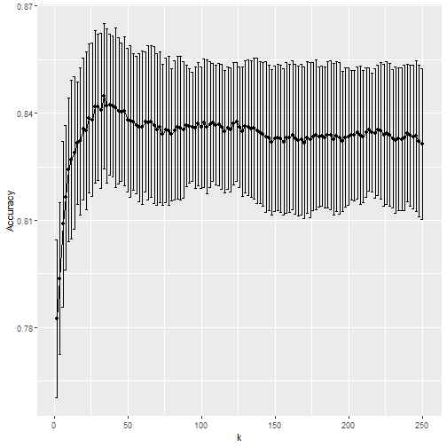

---
title       : Regression Basics
author      : Adam J Sullivan 
job         : Assistant Professor of Biostatistics
work        : Brown University
framework   : io2012        # {io2012, html5slides, shower, dzslides, ...}
highlighter : highlight.js # {highlight.js, prettify, highlight}
hitheme     :  github     # 
widgets     : [mathjax, quiz, bootstrap, interactive] # {mathjax, quiz, bootstrap}
ext_widgets : {rCharts: [libraries/nvd3, libraries/leaflet, libraries/dygraphs]}
mode        : selfcontained # {standalone, draft}
knit        : slidify::knit2slides
logo        : publichealthlogo.png
biglogo     : publichealthlogo.png
assets      : {assets: ../../assets}
---  .segue bg:grey


# Questions for Today

--- .class #id


## Questions

- Go to www.slido.com
- Enter #L011
- You can ask questions in real time and upvote questions as well. 


---.segue bg:grey

# Now We Start Statistics


--- .segue bg:grey


# Regression Basics

--- .class #id

## Regression Outcomes

- Regression simply put is relating a variable with other variables. 
- The way in which we do this depends on the outcome (dependent variable)


--- .class #id

## What the class will model

- In regression we start out by thinking of the outcome first. 
- Once we understand what this will look like, we move to simple regressions relating each variable with that outcome. Finally we move into building a more complex and realistic model that is our best way to describe reality. 
- In this class we will follow this process. 


--- .class #id

## Types of Variables

- We have 2 types of data that we will consider
- ***Discrete*** This is data which we place things into bins. 
    - ***Ordinal Data***: Sometimes these bins can be arranged in a logical order from least to greatest
    - ***Nominal Data***: Other times there is no natural ordering and the data are just named categories. 
- ***Continuous*** This is data that cannot be placed into a finite number of bins. It can take on any value. 


--- .class #id


## Probability Distribution

- With every type of variable, we try to find a mathematical way to explain what we see in the world. 
- We call these probability models. In statistics we specifically refer to these as probability distributions. 

---  .segue bg:grey

# Discrete Distributions


--- .class #id


## Discrete Distributions

- We will take the time to consider some of the key discrete distributions. We will not do regression with all of these in this class but it is important to know how they work and how they are connected. 
- We will cover (In bold are the ones we will use for regression)
    - **Bernoulli**
    - **Binomial**
    - Geometric
    - Negative Binomial
    - Hypergeometric
    - **Poisson**

--- .class #id

## Bernoulli Distribution
    
- The Bernoulli is the simplest probability distribution it represents only 2 values, many times we just use 0 or 1. 
- We say that 1 is  a success that happens with probability $p$. 
- The mean of this is $p$
- The variance is $p(1-p)$. 


--- .class #id

## Bernoulli Distribution

- Mathematically the distribution is 
$$p_X(x) = p^x(1-p)^{1-x}\;\;\;\;\; x=0,1 $$
- We would say that $X$ is distributed as Bernoulli$(p)$ and write this as $X\sim \text{Bern}(p)$. The number $p$ is called the \textbf{parameter} of the distribution. 

--- .class #id

## Bernoulli Disribution Example 

- With a Bernoulli Trial the outcomes are typically called a ``Success'' or ``Failure.'' These successes may not be a positive thing as the word success implies but any outcome that a researcher is interested in. 
- For example in public health this may be whether someone contracted HIV.

--- .class #id

##  Indicator Variable

- Many times in statistics we use what is called an **indicator variable** sometimes called a **dummy variable**.
- If we have an event $A$ then the indicator random variable is equal to 1 if $A$ occurs and 0 if $A$ does not occur. 

--- .class #id

## Binomial Distribution

- Suppose you have $n$ independent trials where the results of each trial are `success` or `failure`.
- Suppose further that the probability of a `success` is $p$ and the probability of a `failure` is $1-p$. 
- Then the total number of successes is a binomial random variable with parameters $n$ and $p$. 
- The mean is $np$.
- The variance is $np(1-p)$

--- .class #id

## Binomial Distribution

- Mathematically we write this as
$$ p_X(k) = \binom{n}{k}p^k(1-p)^{n-k} \; \; \; \; \text{for $k=0,\ldots,n$ otherwise $p_X(k)=0$} $$
- This pmf considers $k$ which is the number of successes.
- Using the Bernoulli distribution and the multiplication principle we see that any sequence of $k$ successes has a probability of $p^k(1-p)^{n-k}$. 
- The total number of sequences with $k$ successes is $\binom{n}{k}$ which gives us the above pmf. 

--- .class #id

## Binomial Example 

- Suppose we have a sample of five phlebotomists (similar with respect to many personal characteristics) who were exposed to Hepatitis B via a needlestick accident.
- Suppose that it is reasonable to assume a health worker exposed to Hep-B via needlestick has a 30% chance of developing the disease. 
- Let $X$ represent how many of the five phlebotomists develop Hepatitis B.  

--- .class #id


## Binomial Example

We know that $X\sim \text{ Bin}(n,p)$ where $n=5$. Then we have the following pmf:
$$p(k)= \binom{5}{k}p^x(1-p)^{n-k}\;\;\;\;\;\;\;\; k=0,1,2,3,4,5$$
These probabilities give us the following table:


| $k$ | $\Pr(k)$ | 
| ----- | -------- | 
| 0 |  0.16807 | 
| 1 |  0.36015 | 
| 2 |  0.30870 | 
| 3 |   0.13230| 
| 4 |  0.02835 | 
| 5 |  0.00243 | 


--- .class #id


## Geometric Distribution


- Let's assume that a scientist has heard of a rare genetic mutation that may make a person less susceptible to heart disease. 
- This scientist is not sure that this warrants a large clinical study yet but wants to obtain a sample of blood from an individual with this mutation. 
- If the probability of a person having this mutation is $p$ and the scientist gets permission to sample blood from a blood bank until they find one with the mutation the probability of getting that one success would follow a geometric distribution.


--- .class #id

## Geometric Distribution

- Mathematically we write this as
$$ p_X(k) = (1-p)^{k-1}p\qquad \text{ for } k=1,2,\ldots$$
- We would way that this is a **Geometric distribution** with parameter $p$. 


--- .class #id

## Negative Binomial Distribution

- If we have the same scientist but this time he wants to sample the blood until he has $r$ successes in all then this would be a negative binomial distribution. - Mathematically we write this as 
$$ p_X(k) = \binom{k-1}{r-1}p^r(1-p)^{k-r}\qquad \text{ for } k=1,2,\ldots$$
- We would way that this is a **Negative Binomial distribution** with parameters $r$ and $p$. 
- In mathematical terms, $X\sim \text{ NB}(r,p)$. 


--- .class #id

## Hypergeometric Distribution

- If we have a population with $h$ healthy people and $u$ unhealthy people, then choosing $n$ people from this population *with replacement* gives us a Bin$(n,u/(u+h))$ distribution for the number of unhealthy people chosen in the $n$ trials, since each trial are independent Bernoulli with probability of success, $\dfrac{u}{u+h}$. 
- If we sample from this population *without replacement* then the number of unhealthy people follows a **Hypergeometric Distribution.**


--- .class #id

## Hypergeometric Distribution:

- Mathematically we write this as 
$$ p_X(k) = \dfrac{\binom{u}{k}\binom{h}{n-k}}{\binom{u+h}{n}}$$
- for integers $k$ such that $0\le k\le u$ and $0\le n-k \le h$.
- We would say that this is a **Hypergeometric distribution** with parameters $u,h$ and $n$. 
- In mathematical terms, $X\sim \text{ HGeom}(u,h,n)$. 


--- .class #id


## Hypergeometric Distribution Example

- Using our counting methods we can see that there are $\binom{u}{k}$ ways to draw $k$ unhealthy people from $u$ and $\binom{h}{n-k}$ ways to draw the remaining healthy people from $h$. 
- Then the multiplication principle gives us that $\binom{u}{k}\binom{h}{n-k}$ ways to draw $k$ healthy and $n-k$ healthy people from the population and there are $\binom{u+h}{n}$ ways to draw $n$ people. 
- Then by the naive definition of probability:
$$ \Pr(X=k) = \dfrac{\binom{u}{k}\binom{h}{n-k}}{\binom{u+h}{n}}$$


--- .class #id


## Difference Between Binomial and Hypergeometric Distributions

- It can be easy to confuse between the Binomial and Hypergeometric distributions at times. 
- We are looking for $k$ successes in both of these instances. What needs to be remembered is that the Binomial Distribution consists of *independent* Bernoulli trials. 
- The Hypergeometric however has *dependent* Bernoulli trials due to the fact that when you remove one success you change the probability of getting another success. 
- Be mindful of this when considering what distribution represents your particular problem at hand. 


--- .class #id

## Poisson Distribution

- Suppose that a hospital has observed 10 cases of a rare cancer of the past 20 years (0.5 cases per year). 
- Suddenly the hospital observes 3 cases in 1 year. How unusual is this given that the hospital treats about 25,000 patients a year. 
- This story best fits a **Poisson Distribution.**


--- .class #id

## Poisson Distribution

- Mathematically we write
$$ p_X(k) = \dfrac{e^{-\lambda}\lambda^k}{k!} \qquad \text{for } k = 0, 1,2, \ldots$$
- We would way that this is a \textbf{Poisson distribution} with parameter $\lambda$. 
- In mathematical terms, $X\sim \text{ Pois}(\lambda)$.


---  .segue bg:grey

# Continuous Random Variables


--- .class #id

## Continuous Random Variables 


- We are often interested in random variables that can take on a a range of values that is continuous or uncountably infinite .
- We will consider some named distributions of this type. 


--- .class #id

## Uniform Distribution

- A Uniform random variable on the interval $(a,b)$ is a completely random number between $a$ and $b$. 
- In order for this to be completely random we specify that the PDF be a constant over that entire interval. 
- Mathematically we write this as 
$$
   f(x) = \left\{
     \begin{array}{lr}
       \dfrac{1}{b-a} & \text{if} a<x<b,\\
       0 & otherwise
     \end{array}
   \right.
$$
- We denote this by $U\sim \text{Unif}(a,b)$. 


--- .class #id

## Standard Uniform Distribution

- We most use the Unif(0,1) distribution or the standard Uniform distribution. 
- This is very easy to use as the PDF is $f(x)=1$ and the CDF is $F(x)=x$. 


--- .class #id

## Exponential Distribution

- The Exponential distribution is similar to the Geometric distribution. 
- The Geometric distribution was the number of trials before the first success. With the Exponential distribution we are concerned with the waiting time before a success.
- We have that successes arrive at a rate of $\lambda$ successes per the time interval $t$. The average success rate for $t$ is $\lambda t$.
- So while the Geometric distribution counts the number of failures before a success, the Exponential distribution is the waiting time before the first success. 


--- .class #id

## Exponential Distribution

- Mathematically we write this as 
$$ f(x)=\lambda e^{\lambda x}, \;\;\;\;\;\;\;\; x\ge0$$
- We represent this as $X\sim \text{ Exp}(\lambda)$. 


--- .class #id

## Gamma Distribution

- The Gamma distribution is similar to the exponential distribution with the exception that rather than it being waiting time of the first success it represents the waiting time for multiple successes. 
- Mathematically we write 
$$ f(x) = \dfrac{\lambda^\alpha}{\Gamma(\alpha)} x^{\alpha-1}e^{-\lambda x}dx, \;\;\;\;\;\; x\ge0$$
- We represent this as $X\sim \text{ Gamma}(\alpha, \lambda)$.\\


--- .class #id

## Normal Distribution

- The normal distribution is a very common and well used distribution. 
- It plays a central role in much of the theory of probability and statistics. We will see why this distribution is so useful in later parts of this course, in the meantime whether or not you have taken a course in statistics or not you have most likely heard of or seen a bell curve which is the shape of this PDF. 
- Mathematically we write

$$f(x) = \dfrac{1}{\sigma\sqrt{2\pi}}e^{-(x-\mu)^2/2\sigma^2}, \;\;\;\;\;\;\;\; -\infty<x<\infty$$

- We represent this as $X\sim N(\mu,\sigma^2)$. 


--- .class #id


## Standard Normal Distribution:

- We call $\mu$ the mean of the normal distribution and $\sigma$ it's standard deviation. 
- One Normal distribution that we will use a great deal in the future has a mean of 0 and a standard deviation of 1.
- We typically call this $Z$ and $Z\sim N(0,1)$. 
- We can take any normal distribution $X\sim N(\mu,\sigma^2)$ and then $Z=\dfrac{X-\mu}{\sigma}$. \\

--- .class #id


## What Do we Do with This Knowledge
- The stories of these random variables directly informs what regressions we consider. 
- We will study a few of these outcomes in further detail so that we may understand how to model and work with data. 


--- .segue bg:grey


# Linear Regression 


--- .class #id

## Outline


1. One Categorical Covariate
2. One Continuous Covariate
3. Multiple Covariates


--- .class #id

## The Data for Class

- We will consider the data behind the story: ["Comic Books are Still Made By Men, For Men and About Men"](http://fivethirtyeight.com/features/women-in-comic-books/).
- This data is part of the `fivethirtyeight` package:
- To explore the variable names run the following code:


```r
library(fivethirtyeight)
?comic_characters
```

--- .class #id

## Appearances

- We will consider appearances on the comic books. 
- We will see what predicts the number of appearances. 

--- .segue bg:grey


# One Categorical Covariate - Binary

--- .class #id

## Binary Covariate

- With this type of covariate, we are comparing some outcome against 2 different groups. 
- In order to make these comparisons it depends on the outcome we are working with. 
- We will perform these tests based on the outcome and then use confidence intervals to assess. 

--- .class #id


## Differences in appearances by publisher

- Let's consider the difference in appearances by publisher


```r
library(fivethirtyeight)
library(tidyverse)

cnt <-  comic_characters%>% 
  group_by(publisher) %>%
  tally()
mn<- comic_characters%>% 
  group_by(publisher) %>%
  summarise(mean_app=mean(appearances, na.rm=T))
full_join(cnt,mn)
```

--- .class #id


## Differences in appearances by publisher

- Let's consider the difference in appearances by publisher


```
## # A tibble: 2 x 3
##   publisher     n mean_app
##   <chr>     <int>    <dbl>
## 1 DC         6896     23.6
## 2 Marvel    16376     17.0
```

--- .class #id


## Differences in Appearances by Publisher

- We have learned how to do this previously. 
- We first did this comparison with a t-test
- Then we did this with an F-test in ANOVA

--- .class #id


## Appearance by Publisher: t-test

- Consider this with a t-test


```r
t.test(appearances~publisher, comic_characters)
```

```
## 
## 	Welch Two Sample t-test
## 
## data:  appearances by publisher
## t = 4.9476, df = 13552, p-value = 7.605e-07
## alternative hypothesis: true difference in means is not equal to 0
## 95 percent confidence interval:
##  3.980214 9.203299
## sample estimates:
##     mean in group DC mean in group Marvel 
##             23.62513             17.03338
```

--- .class #id


## Appearances by publisher: ANOVA

- Consider with ANOVA


```r
library(broom)
tidy(aov(appearances~publisher, comic_characters))
```

```
## # A tibble: 2 x 6
##   term         df      sumsq  meansq statistic     p.value
##   <chr>     <dbl>      <dbl>   <dbl>     <dbl>       <dbl>
## 1 publisher     1    199019. 199019.      22.6  0.00000197
## 2 Residuals 21819 191840416.   8792.      NA   NA
```

--- .class #id


## ANOVA vs t-test

- t-test and ANOVA should give us the same results.
- We can see that in our output this is not true. 
- What were the assumptions of ANOVA?

--- .class #id
 

## Appearances by publisher: t-test

- Consider this with a t-test


```r
t.test(appearances~publisher, comic_characters, var.equal=TRUE)
```

```
## 
## 	Two Sample t-test
## 
## data:  appearances by publisher
## t = 4.7577, df = 21819, p-value = 1.971e-06
## alternative hypothesis: true difference in means is not equal to 0
## 95 percent confidence interval:
##  3.876078 9.307436
## sample estimates:
##     mean in group DC mean in group Marvel 
##             23.62513             17.03338
```

--- .class #id


## Linear Regression


```r
model <- lm(appearances~publisher, comic_characters)
tidy(model)
glance(model)
```

--- .class #id

## Linear Regression


```
## # A tibble: 2 x 5
##   term            estimate std.error statistic  p.value
##   <chr>              <dbl>     <dbl>     <dbl>    <dbl>
## 1 (Intercept)        23.6       1.16     20.4  1.89e-91
## 2 publisherMarvel    -6.59      1.39     -4.76 1.97e- 6
## # A tibble: 1 x 11
##   r.squared adj.r.squared sigma statistic p.value    df  logLik    AIC
##       <dbl>         <dbl> <dbl>     <dbl>   <dbl> <int>   <dbl>  <dbl>
## 1   0.00104      0.000991  93.8      22.6 1.97e-6     2 -1.30e5 2.60e5
## # ... with 3 more variables: BIC <dbl>, deviance <dbl>, df.residual <int>
```

--- .class #id


## Interpreting the Coefficients: Categorical

- Intercept is the average for the reference group. 
- Each coefficient is the average change between the reference group and the one of interest. 


--- .class #id


## Interpreting the Coefficients: Categorical

- Intercept interpretation: Every DC character has on average 23.6 appearances. 
- Marvel Coefficient: Every marvel character has on average 6.59 less appearances than DC. 


--- .class #id


## One Binary Categorical Variable - Continuous Outcome

- We can perform
    - t-test with equal variances
    - ANOVA
    - Linear Regression
- All yield the same exact results

--- .class #id


## Assumptions of Linear Regression

- ***Linearity:*** Function $f$ is linear. 
- Mean of error term is 0. 
    $$E(\varepsilon)=0$$
- ***Independence:*** Error term is independent of covariate. 
    $$Corr(X,\varepsilon)=0$$
- ***Homoscedacity:*** Variance of error term is same regardless of value of $X$. 
    $$Var(\varepsilon)=\sigma^2$$
- ***Normality:*** Errors are normally Distributed


--- .class #id

## What about more categories?

- We can also use linear regression with multiple categories. 


```r
mod <- lm(appearances~sex, comic_characters)
tidy(mod)
```


--- .class #id

## What about more categories?

- We can also use linear regression with multiple categories. 


```
## # A tibble: 6 x 5
##   term                      estimate std.error statistic  p.value
##   <chr>                        <dbl>     <dbl>     <dbl>    <dbl>
## 1 (Intercept)                 19.7        14.8    1.33   0.182   
## 2 sexFemale Characters         1.37       14.8    0.0927 0.926   
## 3 sexGenderfluid Characters  263.         69.2    3.80   0.000146
## 4 sexGenderless Characters    -6.82       26.4   -0.258  0.796   
## 5 sexMale Characters          -0.640      14.8   -0.0433 0.965   
## 6 sexTransgender Characters  -15.7        96.7   -0.162  0.871
```


--- .class #id

## How do we interpret? 

- We need to know the baseline. 


```
## # A tibble: 7 x 3
##   sex                        n mean_sex
##   <chr>                  <int>    <dbl>
## 1 Agender Characters        45    19.7 
## 2 Female Characters       5804    21.0 
## 3 Genderfluid Characters     2   282.  
## 4 Genderless Characters     20    12.8 
## 5 Male Characters        16421    19.0 
## 6 Transgender Characters     1     4   
## 7 <NA>                     979     5.13
```


--- .class #id

## Working with Factors

- Since we are interested in knowing whether or not male characters appear more often, we need to change how we view the factor.
- We will work on the following:
      - Renaming factors
      - Reordering factor levels. 


--- .class #id


## Working with Factors: Renaming


```r
comic_characters <- comic_characters %>%
      mutate(sex = fct_recode(sex, 
      "Agender" = "Agender Characters",
      "Female" = "Female Characters", 
      "Genderfluid" = "Genderfluid Characters",
      "Genderless" = "Genderless Characters",
      "Male" = "Male Characters",
      "Transgender" = "Transgender Characters"
      ))
```

--- .class #id


## Working with Factors: Relevel


```r
comic_characters <- comic_characters %>%
      mutate(sex = fct_relevel(sex, 
                  "Female",
                 "Male", 
                 "Transgender", 
                 "Agender",
                  "Genderfluid" ,
                  "Genderless" 
                  
      ))
```


--- .class #id

## Regression again


```r
mod <- lm(appearances~sex, comic_characters)
tidy(mod)
```


--- .class #id

## Regression again


```
## # A tibble: 6 x 5
##   term           estimate std.error statistic  p.value
##   <chr>             <dbl>     <dbl>     <dbl>    <dbl>
## 1 (Intercept)       21.0       1.29   16.3    2.65e-59
## 2 sexMale           -2.01      1.50   -1.34   1.81e- 1
## 3 sexTransgender   -17.0      95.6    -0.178  8.59e- 1
## 4 sexAgender        -1.37     14.8    -0.0927 9.26e- 1
## 5 sexGenderfluid   261.       67.6     3.87   1.10e- 4
## 6 sexGenderless     -8.20     22.0    -0.373  7.09e- 1
```


--- .class #id

## Interpreting the Coefficients: Categorical

- Intercept interpretation: Every Male Character has on average 19 appearances. 
- Agender coefficient: Every Agender character has on average 0.64 more appearances than male characters
- ...


--- .class #id


## Whats happening?


```r
ggplot(comic_characters, aes(x = sex, y = appearances)) +
  geom_point()  + 
  geom_point(stat = "summary", fun.y = "mean", color = "red", size = 3) + 
  theme(axis.text.x = element_text(angle = 90, hjust = 1))
```


--- .class #id


## Whats happening?


