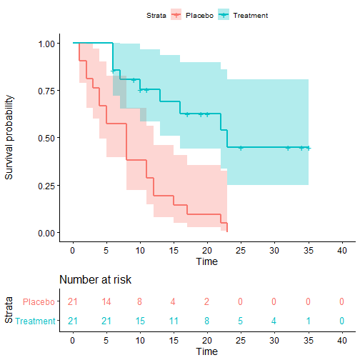
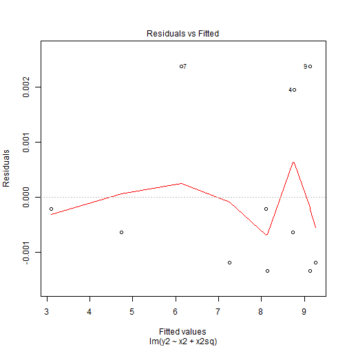
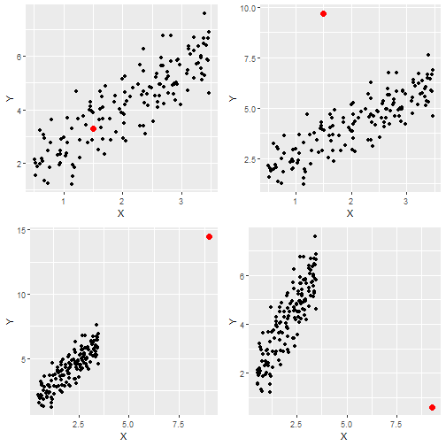
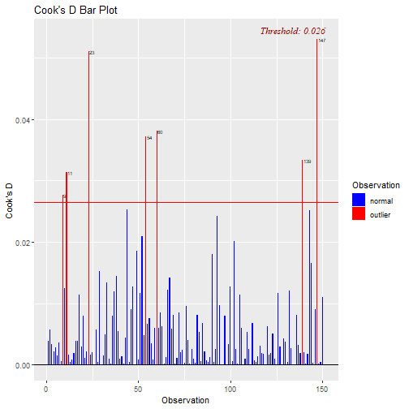
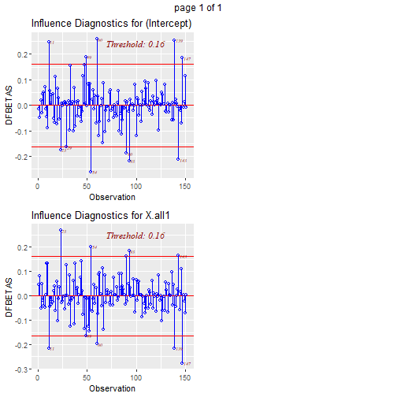
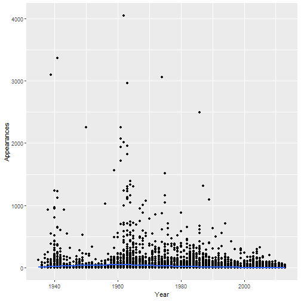
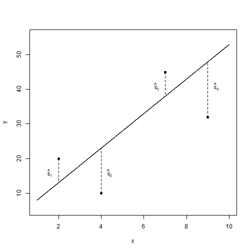
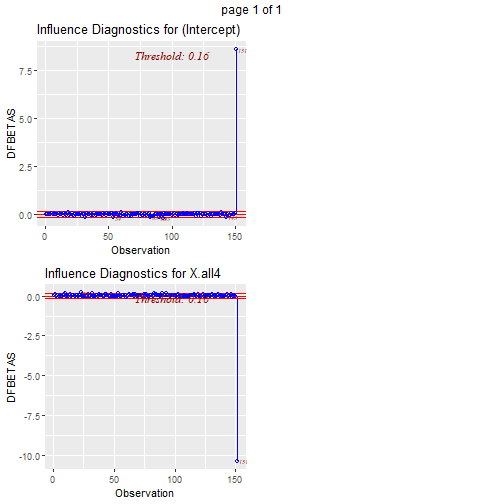

---
title       : Regression Assumptions and Outliers
author      : Adam J Sullivan 
job         : Assistant Professor of Biostatistics
work        : Brown University
framework   : io2012        # {io2012, html5slides, shower, dzslides, ...}
highlighter : highlight.js # {highlight.js, prettify, highlight}
hitheme     :  github     # 
widgets     : [mathjax, quiz, bootstrap, interactive] # {mathjax, quiz, bootstrap}
ext_widgets : {rCharts: [libraries/nvd3, libraries/leaflet, libraries/dygraphs]}
mode        : selfcontained # {standalone, draft}
knit        : slidify::knit2slides
logo        : publichealthlogo.png
biglogo     : publichealthlogo.png
assets      : {assets: ../../assets}
---  .segue bg:grey


# Linear Regression Assumptions

--- .class #id


## Patterns in Residuals

- Patterns in residuals show us that our model is not an adequate summary of the data. 
- Consider what happens when our line is truly linear in nature then
\[Y_i = E(Y_i|X_i=x_i) + \varepsilon_i = \beta_0 + \beta_1x_i + \varepsilon_i\]
- We then fit our regression line $\hat{y}_i= \hat{\beta}_0 + \hat{\beta}_1x_i$. This leads to the residuals
\[\hat{\varepsilon}_i = y_i - \hat{y}_i = \beta_0 + \beta_1x_i + \varepsilon_i - \hat{\beta}_0 - \hat{\beta}_1x_i \approx \varepsilon_i\]
- So the residuals are randomly distributed and centered about 0.


--- .class #id


## Quadratic Patterns in Residuals

 - In the second figure, we can see that we have a quadratic pattern in this. 
- This happens when the true model is quadratic
\[y_i = \beta_0 + \beta_1x_i + \beta_2x_i^2 + \varepsilon_i\]
then we again fit our linear model $\hat{y}_i= \hat{\beta}_0 + \hat{\beta}_1x_i$.
- This leads to the residuals
\[\hat{\varepsilon}_i = y_i - \hat{y}_i = \beta_0 + \beta_1x_i + \beta_2x_i^2+  \varepsilon_i - \hat{\beta}_0 - \hat{\beta}_1x_i \approx\beta_2x_i^2+ \varepsilon_i\]
- So we have a quadratic relationship given our $x$. 


--- .class #id

## Quadratic Patterns in Residuals


- This means we may have been better off by choosing a model that would include a quadratic term for $x$. 
- In model 2 of Anscombe's data had we run a model with a quadratic term we would then have


```r
anscombe$x2sq <- anscombe$x2^2
mod2a <- lm(y2 ~ x2 +  x2sq, data=anscombe)
tidy(mod2a, conf.int=T)[,-c(3,4)]
glance(mod2a)


plot(mod2a,1)
```


--- .class #id


## Quadratic Patterns in Residuals


|term        |   estimate| p.value|  conf.low|  conf.high|
|:-----------|----------:|-------:|---------:|----------:|
|(Intercept) | -5.9957343|       0| -6.005719| -5.9857494|
|x2          |  2.7808392|       0|  2.778441|  2.7832375|
|x2sq        | -0.1267133|       0| -0.126845| -0.1265816|

--- .class #id


## Quadratic Patterns in Residuals


| r.squared| adj.r.squared|     sigma| statistic| p.value| df|   logLik|       AIC|       BIC| deviance| df.residual|
|---------:|-------------:|---------:|---------:|-------:|--:|--------:|---------:|---------:|--------:|-----------:|
| 0.9999995|     0.9999993| 0.0016725|   7378133|       0|  3| 56.47107| -104.9421| -103.3506| 2.24e-05|           8|


--- .class #id


## Quadratic Patterns in Residuals


## Tools for Checking Validity of a Model

When fitting a regression model we will take these steps to verify the validity of the model:

1. Regression Model is Linear in parameters.
2. Residuals are normally distributed.
3. Mean of Residuals is 0. 
4. Homoscedasticity of variances.
5. Variables and residuals are not correlated. 
6. No Influential Points or Outliers


--- .class #id


## Linear in Parameters

- We say it is linear in parameters if the $\beta$ values are linear in nature. 
- Consider the 2nd Anscombe model: 

\[E[Y|x] = \beta_0 + \beta_1 x + \beta_2 x^2\]
- Even though `x2` has been transformed to a square term, the $beta$ values are still linear. 


--- .class #id


## Residuals Plots


```r
plot(mod2,1)
```


--- .class #id

## Residuals Plots


--- .class #id

## Residuals Plots

- The residuals shows us that the residuals did not change by much and we can still see the pattern is the exact same as before but the range of the residuals is what has changed. 


--- .class #id

## Assessing Normality of Residuals: QQ-Plot

- Recall our model 2a. 

```r
plot(mod2a, 2)
```

--- .class #id

## Assessing Normality of Residuals: QQ-Plot


--- .class #id


## Mean of Residuals

- We can test if the mean of residuals is zero with a simple mean function. 


```r
mean(mod2a$residuals)
```

```
## [1] 0
```

--- .class #id


## Homoscedasticity of residuals



--- .class #id


## Homoscedasticity of residuals

- We can see that there is no pattern to the residuals. 
- They appear to be flat and not have a difference in width of the range of values. 
- If we saw a pattern like a cone shape then we would not have homoscedasticity. 


--- .class #id

## Residuals Plot




--- .segue bg:grey

# Leverage and Outliers


--- .class #id

## Leverage and Outliers

- We will now move onto leverage points and outliers. 
- **Leverage point**: is a value of the predictor that is far from the average of the predictor variables. 
- **Outlier points**: is a values of the outcome that is far from the average of the outcome. 


--- .class #id

## Leverage and Outliers

- These two things together help us determine whether certain points have a lot of influence on our regression model. 
- For example in Anscombe model 3 it appears that there is one point that not only is an outlier but may be a leverage point as well. 
- Instead of trying to parse both of these concepts out we will focus on a plot that helps us consider influential points as a whole. 


--- .class #id

## Cook's D 

- Cook's distance attempts to tell us how much $\hat{\beta}$ changes due to the inclusion of the $i^{th}$ observation. 

$$D_i= \dfrac{\sum_{j=1}^n \left( \hat{y}_j - \hat{y}_{j(i)}\right)^2}{(p+1)\hat{\sigma}^2}$$


--- .class #id


## DFFITS

- This quantity measures how much the regression function changes at the  $i$-th case / observation when the  $i$-th case / observation is deleted.
- For small/medium datasets: value of 1 or greater is “suspicious” (RABE). For large dataset: value of  $2\sqrt{(p+1)/n}$.

$$DFFITS_i=\dfrac{\hat{Y_i} - \hat{Y_{i(i)}}}{\hat{\sigma}_{(i)}\sqrt{h_{ii}}}$$


--- .class #id


## What is $h_{ii}$?

- In regression we have something we call the hat matrix, for a matrix $X$:
$$H=X(X^TX)^{-1}X^T$$
- We actually solve regression by performing this operation:
$$\hat{y} = Hy$$


--- .class #id


## What is $h_{ii}$?

- This ends up meaning that we have:
$$\hat{y}_i = h_{i1}y_1 + h_{i2}y_2 + \cdots + h_{ii}y_i + \cdots + h_{in}y_n$$


--- .class #id


## DFBETAS

- This quantity measures how much the coefficients change when the $i$-th case is deleted.
$$DFBETAS_{j(i)}= \dfrac{\hat{\beta}_j - \hat{\beta}_{j(i)}}{\sqrt{\hat{\sigma}^2_{(i)}(X^TX)^{-1}_{jj}}}$$
- For small/medium datasets: absolute value of 1 or greater is “suspicious”. For large dataset: absolute value of  $2/\sqrt{n}$ .


--- .class #id


## Simulating Data


```r
set.seed(12345)
X = runif(150, .5, 3.5)
beta0 = 1.0
beta1 = 1.5
sigma = 0.7
Y = beta0 + beta1*X + sigma*rnorm(150) # The regular process
# Contaminated data: Four cases
X.suspect1 = 1.5; Y.suspect1 = 3.3
X.suspect2 = 1.5; Y.suspect2 = 9.7
X.suspect3 = 9.0; Y.suspect3 = 14.5
X.suspect4 = 9.3; Y.suspect4 = 0.6
Y.all1 = c(Y, Y.suspect1); X.all1 = c(X, X.suspect1)
Y.all2 = c(Y, Y.suspect2); X.all2 = c(X, X.suspect2)
Y.all3 = c(Y, Y.suspect3); X.all3 = c(X, X.suspect3)
Y.all4 = c(Y, Y.suspect4); X.all4 = c(X, X.suspect4)
```


--- .class #id

## Plots of Data




--- .class #id

## Run the 4 Regressions


```r
out1 <- lm(data=data, Y.all1~X.all1 )
out2 <- lm(data=data, Y.all2~X.all2 )
out3 <- lm(data=data, Y.all3~X.all3 )
out4 <- lm(data=data, Y.all4~X.all4 )
```


--- .class #id


## Outliers and Influential Points Plots


```r
library(olsrr)
ols_plot_cooksd_bar(out1)
ols_plot_dfbetas(out1)
ols_plot_dffits(out1)
```


--- .class #id

## Outliers and Influential Points Plots: Cook's D




--- .class #id

## Outliers and Influential Points Plots: DFBETAS




--- .class #id

## Outliers and Influential Points Plots: DFFITS




--- .class #id


## Outliers and Influential Points Plots


```r
library(olsrr)
ols_plot_cooksd_bar(out4)
ols_plot_dfbetas(out4)
ols_plot_dffits(out4)
```


--- .class #id


## Outliers and Influential Points Plots: Cook's D



--- .class #id


## Outliers and Influential Points Plots: DFBETAS



--- .class #id


## Outliers and Influential Points Plots: DFFITS


--- .class #id


## Outliers and Influential Points Plots: Cook's D


--- .class #id


## What can we do with this point?

- We can decide to remove the point and re-run the regression. 


```r
library(broom)
out4a <- lm(data=data[-151,], Y.all4~X.all4 )

tidy4a <- tidy(out4a, conf.int = T)
tidy4 <- tidy(out4, conf.int = T)
knitr::kable(bind_rows(tidy4, tidy4a)[-c(3,4)])

glance4a <- glance(out4a)
glance4 <- glance(out4)
knitr::kable(bind_rows(glance4, glance4a))
```


--- .class #id


## What can we do with this point?


|term        |  estimate| p.value|  conf.low| conf.high|
|:-----------|---------:|-------:|---------:|---------:|
|(Intercept) | 2.3977868|       0| 1.9682861|  2.827287|
|X.all4      | 0.8313212|       0| 0.6518475|  1.010795|
|(Intercept) | 1.2495210|       0| 0.9491648|  1.549877|
|X.all4      | 1.4092337|       0| 1.2773737|  1.541094|


--- .class #id


## What can we do with this point?


| r.squared| adj.r.squared|     sigma| statistic| p.value| df|    logLik|      AIC|      BIC|  deviance| df.residual|
|---------:|-------------:|---------:|---------:|-------:|--:|---------:|--------:|--------:|---------:|-----------:|
| 0.3598977|     0.3556017| 1.1853180|   83.7753|       0|  2| -238.9247| 483.8494| 492.9013| 209.34182|         149|
| 0.7508560|     0.7491726| 0.7272015|  446.0339|       0|  2| -164.0513| 334.1026| 343.1345|  78.26566|         148|


--- .class #id


## Marginal Model Plots

- We will consider the next level of plots called Marginal Model Plots. 
- The aim of these plots is to show how well out model fits the data. 


```r
library(car)
mmps(out4)
```


--- .class #id


## Marginal Model Plots


--- .class #id


## What Can we See?

- From the figure we can see that the blue line represents a loess(smoothing) line for the data and the dashed line represents the model which R fitted. 
- We can see that our data is very skewed by the outlier 
- Also we can see that the loess line is more curved than our data model. 


--- .class #id

## What happens when we Delete points?

- When we remove the point the difference is drastic 

```r
mmps(out4a)
```


--- .class #id

## What happens when we Delete Points??


--- .class #id

## Outlier Treatment


- Once the outliers are identified and you have decided to make amends as per the nature of the problem, you may consider one of the following approaches.
    1. Imputation
    2. Capping
    3. Prediction

--- .class #id

## Imputation

- We can impute the value by replacing it with:
    - mean
    - median
    - mode
    - Other Regression techniques
- We will consider this further in missing Data. 


--- .class #id

## Capping

- For missing values that lie outside the 1.5*IQR limits, we could cap it by replacing those observations outside the lower limit with the value of 5th %ile and those that lie above the upper limit, with the value of 95th %ile. 
- Below is a sample code that achieves this.

```
x <- dataframe$variable_of)interest
qnt <- quantile(x, probs=c(.25, .75), na.rm = T)
caps <- quantile(x, probs=c(.05, .95), na.rm = T)
H <- 1.5 * IQR(x, na.rm = T)
x[x < (qnt[1] - H)] <- caps[1]
x[x > (qnt[2] + H)] <- caps[2]
```


--- .class #id

## Prediction

- In yet another approach, the outliers can be replaced with missing values (NA) and then can be predicted by considering them as a response variable. 
- We will discuss this when considering missing data. 
