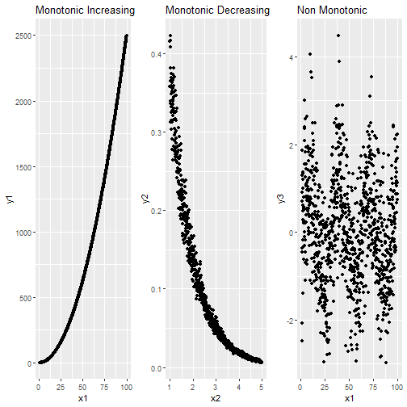

---
title       : Multicollinearity and Basic GLM
author      : Adam J Sullivan 
job         : Assistant Professor of Biostatistics
work        : Brown University
framework   : io2012        # {io2012, html5slides, shower, dzslides, ...}
highlighter : highlight.js # {highlight.js, prettify, highlight}
hitheme     :  github     # 
widgets     : [mathjax, quiz, bootstrap, interactive] # {mathjax, quiz, bootstrap}
ext_widgets : {rCharts: [libraries/nvd3, libraries/leaflet, libraries/dygraphs]}
mode        : selfcontained # {standalone, draft}
knit        : slidify::knit2slides
logo        : publichealthlogo.png
biglogo     : publichealthlogo.png
assets      : {assets: ../../assets}
---  .segue bg:grey


# Multicollinearity

--- .class #id


## What is Multicollinearity

- Multicollinearity exists when 2 or more covariates in a model are moderately or highly correlated. 
- This may be viewed as an easy issue to deal with as many things we may want to control for are just highly correlated. 
- For example, education and income are highly correlated. 


--- .class #id


## Types of Multicollinearity

- Data based: 
    - Could be poorly designed study
    - observational data where only variables collected are all correlated. 
- Structural:
    - Duplicate variables so they are mathematically the same. 
    - Variables that were created from others
        - For example, weight and height are highly correlated with BMI. 


--- .class #id

## Consider the following data:

- This data has been simulated so that it is not collinear:


```
##            response predictor1 predictor2
## response      1.000        0.8      0.202
## predictor1    0.800        1.0      0.000
## predictor2    0.202        0.0      1.000
```
- Let's look at the regressions


--- .class #id


## Regression on Uncorrelated Data

- We will consider the following regressions:
$$\text{Model 1: }Response = \hat{\beta}_0 + \hat{\beta}_1Predictor_1$$
$$\text{Model 2: }Response = \hat{\beta}_0 + \hat{\beta}_1Predictor_2$$
$$\text{Model 3: }Response = \hat{\beta}_0 + \hat{\beta}_1Predictor_1+ + \hat{\beta}_2Predictor_2$$
$$\text{Model 4: }Response = \hat{\beta}_0 + \hat{\beta}_1Predictor_2 + \hat{\beta}_2Predictor_1$$


--- .class #id


## Regression on Uncorrelated Data


|term       |  estimate| p.value|  conf.low| conf.high|
|:----------|---------:|-------:|---------:|---------:|
|predictor1 | 0.8003296|       0| 0.7966066| 0.8040526|
|predictor2 | 0.2016739|       0| 0.1956074| 0.2077403|
|predictor1 | 0.8004000|       0| 0.7968944| 0.8039057|
|predictor2 | 0.2019523|       0| 0.1984514| 0.2054533|
|predictor2 | 0.2019523|       0| 0.1984514| 0.2054533|
|predictor1 | 0.8004000|       0| 0.7968944| 0.8039057|


--- .class #id

## Regression on Uncorrelated Data


| r.squared| adj.r.squared|     sigma|  statistic| p.value|
|---------:|-------------:|---------:|----------:|-------:|
| 0.6396798|     0.6396762| 0.6008585| 177527.401|       0|
| 0.0407269|     0.0407173| 0.9803905|   4245.513|       0|
| 0.6805193|     0.6805129| 0.5657864| 106500.764|       0|
| 0.6805193|     0.6805129| 0.5657864| 106500.764|       0|


--- .class #id


## Sum Squares of Models


|term       | df|     sumsq|    meansq|
|:----------|--:|---------:|---------:|
|predictor1 |  1| 64092.895| 64092.895|
|predictor2 |  1|  4080.641|  4080.641|
|predictor1 |  1| 64092.895| 64092.895|
|predictor2 |  1|  4091.918|  4091.918|
|predictor2 |  1|  4080.641|  4080.641|
|predictor1 |  1| 64104.172| 64104.172|


--- .class #id


## What Do We Notice?

- Coefficients do not change in models. 
- Sums of Squares added to model remain consistent


--- .class #id

## Consider the following data:

- This data has been simulated so that it is highly collinear:


```
##            response predictor1 predictor2
## response      1.000      0.846      0.188
## predictor1    0.846      1.000      0.639
## predictor2    0.188      0.639      1.000
```
- Let's look at the regressions


--- .class #id


## Regression on Correlated Data

- We will consider the following regressions:
$$\text{Model 1: }Response = \hat{\beta}_0 + \hat{\beta}_1Predictor_1$$
$$\text{Model 2: }Response = \hat{\beta}_0 + \hat{\beta}_1Predictor_2$$
$$\text{Model 3: }Response = \hat{\beta}_0 + \hat{\beta}_1Predictor_1+ + \hat{\beta}_2Predictor_2$$
$$\text{Model 4: }Response = \hat{\beta}_0 + \hat{\beta}_1Predictor_2+ + \hat{\beta}_2Predictor_1$$


--- .class #id

## Regression on Correlated Data


|term       |   estimate|   p.value|   conf.low|  conf.high|
|:----------|----------:|---------:|----------:|----------:|
|predictor1 |  0.9289612| 0.0000000|  0.8117562|  1.0461662|
|predictor2 |  0.2349541| 0.0606592| -0.0107236|  0.4806318|
|predictor1 |  1.3475785| 0.0000000|  1.2697073|  1.4254497|
|predictor2 | -0.7444484| 0.0000000| -0.8329782| -0.6559187|
|predictor2 | -0.7444484| 0.0000000| -0.8329782| -0.6559187|
|predictor1 |  1.3475785| 0.0000000|  1.2697073|  1.4254497|


--- .class #id


## Regression on Correlated Data


| r.squared| adj.r.squared|     sigma|  statistic|   p.value|
|---------:|-------------:|---------:|----------:|---------:|
| 0.7162667|     0.7133715| 0.5868151| 247.394788| 0.0000000|
| 0.0354504|     0.0256081| 1.0819531|   3.601826| 0.0606592|
| 0.9267136|     0.9252025| 0.2997678| 613.287170| 0.0000000|
| 0.9267136|     0.9252025| 0.2997678| 613.287170| 0.0000000|


--- .class #id


## Sum Squares of Models


|term       | df|      sumsq|     meansq|
|:----------|--:|----------:|----------:|
|predictor1 |  1|  85.190885|  85.190885|
|predictor2 |  1|   4.216378|   4.216378|
|predictor1 |  1|  85.190885|  85.190885|
|predictor2 |  1|  25.030002|  25.030002|
|predictor2 |  1|   4.216378|   4.216378|
|predictor1 |  1| 106.004508| 106.004508|


--- .class #id


## What did we Notice?

- Coefficients change a lot
- Sum of Squares Depends on the order in which data is in the model. 


--- .class #id


## Signs of Multicollinearity

- Estimates of the coefficients vary from model to model.
- $t$-tests of individual slopes are non-significant but overall F-test is significant. 
- Correlations among covariates are large. 


--- .class #id

## How Can we Detect this?

- Consider the model with just one covariate:

$$y_i= \beta_0 + \beta_kx_{ik} + \varepsilon_i$$
- We can see this variance:
$$Var(b_k)_{min}= \dfrac{\sigma^2}{\sum_{i=1}^n(x_{ik}-\bar{x}_k)^2}$$
- This is the smallest variance will be. 


--- .class #id


## Then the larger model


- Consider the model with just one covariate:

$$y_i= \beta_0 + \beta_1x_{i1} + \cdots +  \beta_kx_{ik} + \cdots \beta_px_{ip} \varepsilon_i$$
- We can see this variance:
$$Var(b_k)= \dfrac{\sigma^2}{\sum_{i=1}^n(x_{ik}-\bar{x}_k)^2}\times\dfrac{1}{1-R^2_k}$$
- $R^2_k$ is the $R^2$ value of the k$^{th}$ predictor on the remaining. 


--- .class #id


## What does this tell us?

- How much is our variance inflated by?

$$\dfrac{Var(b_k)}{Var(b_k)_{min}} =\dfrac{1}{1-R^2_k} $$

- Variance Inflation Factor
$$VIF_k=\dfrac{1}{1-R^2_k}$$


--- .class #id

## Variance Inflation Factor

- Rule of thumb
    - 1 = not correlated.
    - Between 1 and 5 = moderately correlated.
    - Greater than 5 = highly correlated.
- Some suggest anything more than 2.5 should cause concern and definitely over 10.


--- .class #id


## Variance Inflation Factor

- Be careful just judging by it alone
- For example $x$ and $x^2$ may have a high VIF but this would not hurt your model. 
- Also Indicator variables often have a high VIF with each other but this is not an issue. 


--- .class #id


## Calculating in R


```r
library(car)
vif1 <- vif(mod3)
vif2 <- vif(mod4)
knitr::kable(bind_rows(vif1,vif2))
```


--- .class #id

## Calculating in R


| predictor1| predictor2|
|----------:|----------:|
|          1|          1|
|          1|          1|


--- .class #id

## Calculating in R


| predictor1| predictor2|
|----------:|----------:|
|   1.691149|   1.691149|
|   1.691149|   1.691149|


--- .class #id


## How Can We Deal with it?

- Remove Multicollinear variables from model.
    - What might the effects of this be?
- Create a summed score of the collinear variables. 
- Create a score based on something like Principal Component Analysis. 


--- .segue bg:grey

# Generalized Linear Models


--- .class #id

## Generalized Linear Models

- We will introduce a topic that is typically taught only in a class where you are expected to know linear algebra. 
- Fear not though! 
- We will show some of the math behind this but this is to teach you methods that link to the modern way data analysis is done. 


--- .class #id


## Why Bother?

- By learning the *Generalized Linear Models* we can understand how to fit, linear, logistic, Poisson, multinomial, data from distributions like Gamma and Inverse Gamma, longitudinal data and multivariate data.
- We will not have time to learn all of these in this class but this is a very versatile model. 
- The mathematics behind these models are matrix related but we will focus on the application of them. 


--- .class #id


## The Generalized Linear Model

- The generalized linear model refers to a whole family of models.  
- They became popular with a book by McCullagh and Nelder (1982). 
- They have 3 basic components. 


--- .class #id


## Components of any GLM


1. **The Random Component** - probability distribution of the response variable. In linear regression this is the normal distribution. 
2. **The Systematic Component** - fixed structure of explanatory variables usually a linear function. We have seen this as $\beta_0 + \beta_1X_1 + \ldots$. 
3. **The Link Function** - maps the systematic component onto the random component. This was $E(Y_i|X_{1i}, \ldots)$ in the linear regression case. 


--- .class #id

## The Random Component


- Observations of the outcome represent a sample from a random variable.
- This random variable has a mean value and variation that depends on the distribution it follows.
- GLM uses random variables that follow an exponential family distribution. 


--- .class #id


## The Systematic Component

- We use the covariates or independent variables to model to estimate the means of the random variable that our sample was drawn from.
- This is added to the variation to give use the data that we observed. 


--- .class #id


## The Model

-  We use
$$\eta_i = \beta_0 + \beta_1x_{i1} + \beta_2x_{i2} + \cdots + \beta_px_{ip} = \sum_{j=1}^p \beta_jx_{ij}$$

- where: 
    * $\eta$ is the linear predictor.
    * $x_1, \ldots, x_p$ are the explanatory variables.
    * $\beta_1,\ldots,\beta_p$ are the coefficients of the explanatory variables. 
    * $\beta_0$ is the value of $\eta$ when all the $x$'s are 0. 


--- .class #id


## What you typically will see:

- Most of the time this is written as:
$$\mathbf{\eta} = \mathbf{X\beta} $$
- where:
    * $\mathbf{\eta}=(\eta_1, \ldots, \eta_N)^T$ is a column vector.
    * $\mathbf{\beta} = (\beta_0, \ldots,\beta_p)^T$ is a column vector. 
    * $\mathbf{X}$ is a $N\times p$ matrix of the explanatory variables $x_{ij}$ for $i=1,\ldots,N$ and $j=1,\ldots,p$. 


--- .class #id

##  Visualizing the Matrices

- In other words:
$$\mathbf{\eta}= 
\left[\begin{array}{c}
     \eta_1  \\
     \vdots \\
     \eta_N
\end{array} \right]= \left[\begin{array}{cccc}
     1&  x_{11} & \ldots & x_{1p}  \\
     1& x_{21} & \ldots & x_{2p} \\
     \vdots& \vdots &  \vdots & \vdots\\
     1& x_{N1} & \ldots & x_{Np}
\end{array}\right]\left[\begin{array}{c}
     \beta_0\\
     \beta_1 \\
     \vdots\\
     \beta_p
\end{array}\right]= \mathbf{X}\mathbf{\beta}$$
- This linear predictor allows the least squares regression approach to be generalized to a wide range of models. 


--- .class #id


## The Link Function

- We cannot always model a direct relationship between the random and the systematic component. 
- This is where the link function comes into place. 
- This function allows us to specify a relationship between the linear(systematic component) and the random component. 
- We essentially link $\eta_i$ to $\mu_i=E(y_i)$. 


--- .class #id


## The Link Function

- We have
$$g(\mu_i) = \eta_i$$
- where:
    * $g()$ is the link function. 
    * $\mu_i$ represents the expected value of the random component. 
    * $\eta_i$ represents the linear(structural) component. 


--- .class #id


## What is this link Function?

- The link function is specifically defined by how the distribution is identified as an exponential family. 
- We will not go through this math however feel free to look up exponential families and try and put the distributions we talk about into this framework. 


--- .class #id


## Common Link Functions:

- Some common link functions are


 Random Component |   Link Function |    Outcome  |     Explanatory | Model  
------------- |   -------------------- |  --------------- | -------------- |  -----------------------
Normal    |   Identity     |        Continuous |       Factor    |      ANOVA
Normal   |    Identity     |        Continuous |       Continuous  |    Regression  
Binomial  |    Logit        |         Binary    |        Mixed    |       Logistic Regression
Multinomial  |  Generalized logit  |   Binary     |       Mixed      |     Multinomial Regression
Poisson     |      Log              |    Count    |       Mixed      |     Poisson Regression


--- .class #id


## What Does this Mean? 

- The chart shows just some of the many types of models we can learn to do just from a simple concept of GLMs. 
- Essentially every type of technique you have used up until this point can be structured in such a way that is represents a GLM. 


--- .class #id


## Assumptions of a GLM

- The data $Y_1, Y_2, \ldots, Y_2$ are independently distributed. 
- The dependent variable $Y_i$ is from an exponential family.
    * Normal (Gaussian)
    * Bernoulli
    * Binomial
    * Multinomial
    * Exponential
    * Poisson


--- .class #id


## Assumptions of a GLM

- Linear Relationship between link function and systematic component. 
- Errors are independent. 


--- .class #id


## What Assumptions are not needed? 

- We do **NOT** some assumptions we needed before.
    *  We do **NOT** need a linear relationship between the dependent variable and the independent variables. 
    *  We do **NOT** need need normally distributed errors. 
    *  We do **NOT** need homogeneity of errors.


--- .class #id

## What Elses is Different? 

-  Uses Maximum Likelihood Estimation rather than Least Squares Estimation. 
-  For goodness-of-fit tests need large sample sizes. *(Rule of thumb not more than 20\% of cell counts in tables are less than 5).* 


--- .segue bg:grey


# The Case of Linear Regression


--- .class #id

## Linear Regression as a Case

- We have previously been using linear regression and it can be easily display how we use it in this framework. 
- For example in a multiple linear regression we have
$$y_i|x_{i1},\ldots,x_{ip} = \beta_0 + \beta_1x_{i1} + \cdots + \beta_px_{ip} + \epsilon_i$$
- Then we know that 
$$\mu_i = E(y_iy_i|x_{i1},\ldots,x_{ip}) = \beta_0 + \beta_1x_{i1} + \cdots + \beta_px_{ip}$$
- Thus we can directly relate $\mu_i$ to the systematic component. 


--- .class #id

## What Link in the Linear Case?

- Thus in this case our function $g()$ is
$$g(\mu_i) = \mu_i$$
- We call this the identity link. 


--- .class #id


## What do we have? 

- Then we have that
    *  **Random Component**: $y$ is the outcome and is normally distributed. So we let $\epsilon_i\sim N(0\sigma^2)$. 
    *  **Systematic Component**: $x_1,\ldots,x_p$ are the explanatory variables. They can be categorical or continuous. We have a linear combination of these terms but we can still have $x^2$ or $\log(x)$ terms in here as well. 
    *    **Link Function**: 


--- .class #id

## Identity Link

- We have the identity function:
$$
\begin{aligned}
        \eta &= \beta_0 + \beta_1x_{i1} + \cdots + \beta_px_{ip} \\
        g(E(y_i)) &= \beta_0 + \beta_1x_{i1} + \cdots + \beta_px_{ip} \\
        g(E(y_i)) &= E(y_i)
    \end{aligned}
$$
- With linear regression we have the simplest link function because we are able to model the mean directly. 


--- .segue bg:grey


# The Case of Logistic Regression


--- .class #id

## Logistic Regression

- We will now move onto logistic regression. 
- With logistic regression we are concerned with binary data. 
- This is data that is in a format of either yes or no, 0 or 1, or some variation of that. 


--- .class #id

## Binomial Distribution

- If we consider binary data we find that what we have is called the Binomial distribution.
- Let's assume that we have $Y$ where 

$$
Y = \begin{cases} 
1 & \text{if sucess}\\
0 & \text{if failure}
\end{cases}
$$


--- .class #id


##  What Does this mean? 

- Then
$$\Pr(Y=y) =\binom{n}{y} p^y(1-p)^{n-y} $$
- where $p$ is the probability that $Y=1$. 
- This leads us to 

$$E(Y) = np$$
$$Var(Y)= np(1-p)$$


--- .class #id

## Regression Model for Logistic

- Recall from simple linear regression that our systematic part of our model is
$$E(Y_i|x_i) = \beta_0 + \beta_1x_i$$
- That would mean with this type of data we have 
$$p_i = \beta_0 + \beta_1 x_i$$


--- .class #id


## Why Can't we do Linear Regresion?

- The issue with this is now we can have values that fall outside of 0 and 1. 
- To overcome the problem with negative values we could exponeniate:
$$p_i = \exp\left(\beta_0 + \beta_1x_1\right)$$
- We now have values that can fall between 0 and infinity. 


--- .class #id

## What about Values greater than 1?

- In order to solve the problem of values being greater than 1, we divide by 1 plus the exponential:
$$p_i= \dfrac{\exp\left(\beta_0 + \beta_1x\right)}{1+\exp\left(\beta_0 + \beta_1x_1\right)}$$
- This new function now lies completely between 0 and 1 as needed. 
- Then we solve back to where we have the systematic part.


--- .class #id


## The Systematic Part

$$
\begin{aligned}
    p_i &= \dfrac{\exp\left(\beta_0 + \beta_1x_i\right)}{1+\exp\left(\beta_0 + \beta_1x_i\right)}\\
    p_i\left(1+\exp\left(\beta_0 + \beta_1x_i\right)\right)&=\exp\left(\beta_0 + \beta_1x_i\right)\\
    p_i &= \exp\left(\beta_0 + \beta_1x_i\right)\left(1-p_i\right)\\
    \log\left(\dfrac{p_i}{1-p_i}\right) &= \beta_0 + \beta_1x_i\\
    logit\left(p_i\right) &= \beta_0 + \beta_1x_i 
\end{aligned}
$$


--- .class #id

##  What does this mean? 

- This means we are fitting a linear regression to the logistic unit (logit) or the log odds of the probability of a success. 
- This is why we refer to this as logistic regression. 


--- .class #id


## The Logit

Then if we consider the logit:

$$
\begin{aligned}
\text{If } p= 0 & \text{then } \log\left(\dfrac{p}{1-p}\right)=-\infty\\
    \text{If } p= \tfrac{1}{2} & \text{then } \log\left(\dfrac{p}{1-p}\right)=0\\
    \text{If } p= 1 & \text{then } \log\left(\dfrac{p}{1-p}\right)=\infty
\end{aligned}
$$


--- .class #id

## What does the Logit imply?

- We can see that as $p$ increases the logit does as well. 
- We have that the logit can be anything between $-\infty$ and $\infty$, but $p$ is between 0 and 1 as needed.  


--- .class #id

## Relationship Between $p$ and the logit

- We can see the relationship between $p$ and the logit below. 





--- .class #id

## Logistic as a GLM

- From the above work we can see that with logistic regression we have
$$log\left(\dfrac{p}{1-p}\right) = \beta_0 + \beta_1x_1$$
$$\text{or}$$
$$log\left(\dfrac{p}{1-p}\right) = \beta_0 + \beta_1x_1 + \cdots + \beta_px_p$$


--- .class #id


## Logistic as a GLM

- Where $E(y_i|y_{i1},\ldots, x_{ip}) = p_i$ therefore what we have is
    * **Random Component**: $y$ is the outcome and is binomial and we assume the variance to be that of a binomial.
    * **Systematic Component**: $x_1,\ldots,x_p$ are the explanatory variables. They can be categorical or continuous. 
    - We have a linear combination of these terms but we can still have $x^2$ or $\log(x)$ terms in here as well. 


--- .class #id


## The Link Funcion: 

- Where $E(y_i|y_{i1},\ldots, x_{ip}) = p_i$ therefore what we have is
    * **Link Function**: We can see from above that with $p_i$ being the mean that we have the logit as the link function:
    
$$
    \begin{aligned}
        \eta &= \beta_0 + \beta_1x_{i1} + \cdots + \beta_px_{ip} \\
        g(E(y_i)) &= \beta_0 + \beta_1x_{i1} + \cdots + \beta_px_{ip} \\
        g(p_i) &= logit\left(p_i\right) 
    \end{aligned}
$$


--- .class #id


## Maximum Likelihood Estimation

- In linear regression we learned about least squares estimation. 
- This falls apart with logistic regression when we have $p=0$ or $p=1$. 
- Due to this we prefer a technique that can accurately estimate $p$ no matter what. 
- We will map out what this looks like right now. 


--- .class #id


## Our Data

- With our data we have
$$\Pr(Y_i=1|x_i) = \dfrac{\exp\left(\beta_0 + \beta_1x_i\right)}{1+ \exp\left(\beta_0+\beta_1x_i\right)}$$
- Then we also have that 

$$
\begin{aligned}
    \Pr(Y_i=0|x_i) &= 1- \Pr(Y_i=1|x_i)\\
    &= 1 - \dfrac{\exp\left(\beta_0 + \beta_1x_i\right)}{1+ \exp\left(\beta_0+\beta_1x_i\right)}\\
    &= \dfrac{1}{1+ \exp\left(\beta_0+\beta_1x_i\right)}
\end{aligned}
$$


--- .class #id

## Our Data

- If we combine these together we find that:
$$\Pr(Y_i=y_i|x_i) = \dfrac{\exp\left(\left(\beta_0 + \beta_1x_i\right)\cdot y_i\right)}{1+ \exp\left(\beta_0+\beta_1x_i\right)}, \;\;\;y_i=0,1$$


--- .class #id


## The Likelihood

- The likelihood is defined as the probability of obtaining the data that was observed. 
$$\Pr(Y_1=y_1, Y_2=y_2, \ldots, Y_n=y_n| x_1,x_2,\ldots,x_n)$$
- Then we assumed that in our data the responses are independent from one another. 
- This leads to
$$\Pr(Y_1=y_1, Y_2=y_2, \ldots, Y_n=y_n| x_1,x_2,\ldots,x_n) = \Pr(Y_1=y_1|x_1)\cdots \Pr(Y_n=y_n|x_n)$$


--- .class #id

## The Likelihood

- Then the probability we obtain our data is
$$L = \prod_{i=1}^n \left[ \dfrac{\exp\left(\left(\beta_0 + \beta_1x_i\right)\cdot y_i\right)}{1+ \exp\left(\beta_0+\beta_1x_i\right)}\right]$$


--- .class #id

## Maximum Likelihood

- Maximum likelihood estimates for $\beta_0$ and $\beta_1$ are found by searching for which values $\hat{\beta}_0$ and $\hat{\beta}_1$ maximize $L$. 
- Unlike in least squares we cannot find these solutions in a closed form. 
- We calculate MLEs with some sort of iterative technique. 


--- .class #id


## Normal Distribution and Maximum Likelihood

- It can be shown that maximum likelihood estimators are normally distributed.
- This means in our data
$$\hat{\beta}_0 \stackrel{approx}{\sim} N\left(\beta_0, \widehat{Var}\left(\hat{\beta_0}\right)\right)$$
$$\hat{\beta}_1 \stackrel{approx}{\sim} N\left(\beta_1, \widehat{Var}\left(\hat{\beta_1}\right)\right)$$


--- .class #id

## Why do we use MLE?

- Finally we have that MLEs are the most efficient estimators out there.
- Meaning that any other consistent estimators $\tilde{\beta}_0$ and $\tilde{\beta}_1$ will have larger variances then $\hat{\beta}_0$ and $\hat{\beta}_1$. 
- This means we will have the tightest confidence intervals around our MLEs and possibly show significance when other estimators would fail to. 


