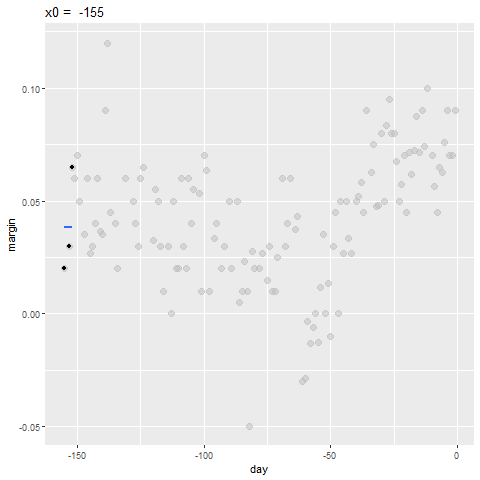
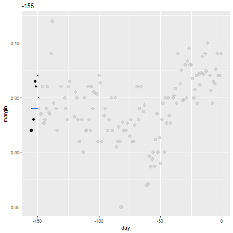

---
title       : Non-parametric Methods
author      : Adam J Sullivan 
job         : Assistant Professor of Biostatistics
work        : Brown University
framework   : io2012        # {io2012, html5slides, shower, dzslides, ...}
highlighter : highlight.js # {highlight.js, prettify, highlight}
hitheme     :  github     # 
widgets     : [mathjax, quiz, bootstrap, interactive] # {mathjax, quiz, bootstrap}
ext_widgets : {rCharts: [libraries/nvd3, libraries/leaflet, libraries/dygraphs]}
mode        : selfcontained # {standalone, draft}
knit        : slidify::knit2slides
logo        : publichealthlogo.png
biglogo     : publichealthlogo.png
assets      : {assets: ../../assets}
---  .segue bg:grey


```{r setup, include = FALSE, cache = FALSE}
library(knitr)
opts_chunk$set(error = TRUE)
opts_chunk$set(warning=FALSE)
opts_chunk$set(message=FALSE)
opts_chunk$set(results="hold")
opts_chunk$set(cache=F)
opts_chunk$set(  tidy=F,size="small")
opts_chunk$set(tidy.opts=list(width.cutoff=60))
options(digits = 3, scipen = 3)
```

# Non Parametric Statistics

--- .class #id

## What are they?

- Non parametrics means that you do not need to specify a specific distribution for the data. 
- Many of the methods you have learned up to this point require data dealing with the normal distribution. 
- This is due partially to the fact that the t-distribution, $\chi^2$ distribution, and the $F$ distribution can all be derived from the normal distribution. 
- Traditionally you are just taught to use normallity and made to either transform the data or just go ahead knowing it is incorrect. 


--- .class #id

## Normal vs Skewed Data 

- Data that is normally distributed has:
    - the mean and the median the same.
    - The data is centered about the mean.
    - Very specific probability values.
- Data that is skewed has: 
    - Mean less than median for left skewed data.
    - Mean greater than median for right skewed data. 


--- .class #id


## Why is this an issue?

- In 1998 a survey was given to Harvard students who entered in 1973:
  - The mean salary was $750,000
  - The median salary was $175,000
- What could be a problem with this?
- What happened here? 

--- .class #id


## Why do we use Parametric Models?

1. Parametric Models have more power so can more easily detect significant differences. 
2. Given large sample size Parametric models perform well even in non-normal data. 
3. Central limit theorem states that in research that can be perfromed over and over again, that the means are normally distributed. 
4. There are methods to deal with incorrect variances. 

--- .class #id


## Why do we use Non Parametric Models?

1. Your data is better represented by the median. 
2. You have small sample sizes. 
3. You cannot see the ability to replicate this work. 
4. You have ordinal data, ranked data, or outliers that you can’t remove.

--- .class #id


## What Non Parametric Tests will we cover? 

- Sign Test
- Wilcoxon Signed-Rank Test
- Wilcoxon Rank-Sum Test (Mann-Whitney U Test, ...)
- Kruskal Wallis test
- Spearman Rank Correlation Coefficient
- Bootstrapping


--- .segue bg:grey


# The sign Test

--- .class #id

## The Sign Test

- The sign test can be used when comparing 2 samples of observarions when there is not independence of samples. 
- It actually does compares matches together in order to accomplish its task. 
- This is similar to the paired t-test
- No need for the assumption of normality. 
- Uses the Binomial Distribution


--- .class #id

## Steps of the Sign Test

- We first match the data 
- Then we subtract the 2nd value from the 1st value. 
- You then look at the sign of each subtraction. 
- If there is no difference between the two groups you shoul have roughly 50% positives and 50% negatives. 
- Compare the proportion of positives you have to a binomial with p=0.5. 

--- .class #id


## Example: Binomial Test Function

- Consider the scenario where you have patients with Cystic Fibrosis and health individuals. 
- Each subject with CF has been matched to a healthy individual on age, sex, height and weight. 
- We will compare the Resting Energy Expenditure (kcal/day)

--- .class #id


## Reading in the Data

```{r, error=F}
library(readr)
ree <- read_csv("ree.csv")
ree
```


--- .class #id


## Function in R

- Comes from the `BDSA` Package

```
SIGN.test(x ,y, md=0, alternative = "two.sidesd",
conf.level=0.95)
```

- Where 
  - `x` is a vector of values
  - `y` is an optional vector of values.
  - `md` is median and defaults to 0. 
  - `alternative` is way to specific type of test.
  - `conf.level` specifies $1-\alpha$.

--- .class #id

## Getting Package

```{r}

# install.packages("devtools")
# devtools::install_github('alanarnholt/BSDA')
```

--- .class #id


## Our Data

```{r, eval=FALSE}
library(BSDA)
attach(ree)
SIGN.test(CF, Healthy)
detach()
```

--- .class #id


## Our Data

```{r, echo=FALSE}
library(BSDA)
attach(ree)
SIGN.test(CF, Healthy)
detach()
```

--- .class #id

## By "Hand"

- Subtract Values

```{r, eval=FALSE}
library(tidyverse)
ree <- ree %>%
mutate(diff = CF - Healthy)
ree
```

--- .class #id


## By "Hand"


- count negatives

```{r, echo=FALSE}
library(tidyverse)
ree <- ree %>%
mutate(diff = CF - Healthy)
ree
```

--- .class #id

## By "Hand"

```{r}
binom.test(2,13)
```

--- .segue bg:grey

# Wilcoxon Signed-Rank Test

--- .class #id

## Wilcoxon Signed-Rank Test

- The sign test works well but it truly ignores the magntiude of the differences. 
- Sign test often not used due to this problem. 
- Wilcoxon Signed Rank takes into account both the sign and the rank


--- .class #id

## How does it work? 

- Pairs the data based on study design. 
- Subtracts data just like the sign test.
- Ranks the magnitude of the difference:

```
8
-17
52
-76
```

--- .class #id


## What happens with these ranks?

| Subtraction | Positive Ranks | Negative Ranks |
| ----------- | -------------- | -------------- | 
| 8  | 1 |  | 
| -17 |  | -2 | 
| 52 | 3 |  | 
| -76 |  | -4 | 
**Sum** | **4** | **-6** |


--- .class #id


## What about after the sum?

- $W_{+}= 1 + 3 = 4$
- $W_{-} + -2 + -4 = -6$
- Mean: $\dfrac{n(n+1)}{4}$
- Variance: $\dfrac{n(n+1)(2n+1)}{24}$

--- .class #id

## What about after the sum?

- Any ties, $t$: decrease variance by $t^3-\dfrac{t}{48}$
- z test:

$$ z =\dfrac{W_{smaller}- \dfrac{n(n+1)}{4}}{\sqrt{\dfrac{n(n+1)(2n+1)}{24}-t^3-\dfrac{t}{48}}}$$

--- .class #id


## Wilcoxon Signed Rank in R

```{r}
attach(ree)
wilcox.test(CF, Healthy, paired=T)
detach(ree)
```


--- .segue bg:grey

# Wilcoxon Rank-Sum Test

--- .class #id

## Wilcoxon Rank-Sum Test

- This test is used on indepdent data. 
- It is the non-parametric version of the 2-sample $t$-test.
- Does not requre normality or equal variance. 

--- .class #id


## How do we do it?

- Order each sample from least to greatest
- Rank them. 
- Sum the ranks of each sample

--- .class #id


## What do we do with summed ranks?

- $W_s$ smaller of 2 sums.
- Mean: $\dfrac{n_s(n_s+n_L + 1)}{2}$
- Variance: $\dfrac{n_sn_L(n_s+n_L+1)}{12}$
- z-test

$$ z = \dfrac{W_s-\dfrac{n_s(n_s+n_L + 1)}{2}}{\sqrt{\dfrac{n_sn_L(n_s+n_L+1)}{12}}}$$


--- .class #id


## Wilcoxon Rank-Sum in R

- Consider built in data `mtcars`

```{r}
library(tidyverse)
cars <- as_data_frame(mtcars)
cars
```

--- .class #id


## Wilcoxon Rank-Sum in R

- We will Consider `mpg` and `am`
- `mpg`: Miles Per Gallon on Average
- `am`
    - 0: automatic transmission
    - 1: manual transmission


--- .class #id


## Wilcoxon Rank-Sum in R

```{r}
attach(cars)
wilcox.test(mpg, am)
detach(cars)
```


--- .segue bg:grey


# Kruskal Wallis Test

--- .class #id

## Kruskal Wallis Test

- If we have multiple groups of independent data that are not normally distributed or have variance issues, you can use the Kruskal Wallis Test.
- It tests significant differences in medians of the groups. 
- This is a non-parametric method for One-Way ANOVA.
- Harder to try and calculate by hand, so we will just use R.

--- .class #id

## Kruskal Wallis Test in R

```
kruskal.test(formula, data, subset, ...)
```

- Where
    - `formula` is `y~x` or can enter `outcome,group` instead.
    - `data` is the dataframe of interest.
    - `subset` if you wish to test subset of data. 

--- .class #id


## Arthritis Data

- comes from the `BSDA` package. 
- `Arthriti`

| Variable | Description | 
| -------- | ----------- | 
| `time` | Time in Days until patient felt relief | 
| `treatment` | Factor with three levels `A`, `B`, and `C` |


--- .class #id

## Arthritis Data

```{r}
library(BSDA)
Arthriti
```

--- .class #id


## Kruskal-Wallis Test in R

```{r}
kruskal.test(time~treatment, data=Arthriti)
```


--- .segue bg:grey


#  Spearman Rank Correlation Coefficient

--- .class #id


##  Spearman Rank Correlation Coefficient


- Correlation is a measurement of the strength of a linear relationship between variables. 
- This means it does not necessarily get the actual magnitude of relationship. 
- Spearman Rank Correlation seeks to fix this. 
- It works with Montonic Data.

--- .class #id

## Monotonic Data

```{r, echo=F}
library(ggplot2)
library(gridExtra)

x1 <- seq(1,100, length=1000)
x2 <- seq(1,5, length=1000)

y1 <- (1/4) * x1^2 + rnorm(1000,0,1) # Monotonically Increasing Function
y2 <- exp(-x2+ rnorm(1000,0,0.1)) # Montonically Decreasing
y3 <- sin(x1 / 5) + rnorm(1000,0,1) # Not Monotonic

df <- as_data_frame(cbind(x1,x2,y1,y2,y3))


p1 <- ggplot(df, aes(x1,y1)) +
  geom_point() + 
  ggtitle("Monotonic Increasing")
  
p2 <- ggplot(df, aes(x2,y2)) +
  geom_point() + 
  ggtitle("Monotonic Decreasing")
  
p3 <- ggplot(df, aes(x1,y3)) +
  geom_point() + 
  ggtitle("Non Monotonic")


grid.arrange(p1,p2,p3, nrow=1)
```

--- .class #id


## Spearman Rank Correlation in R

- We can do this the the `cor()` function. 

```{r}
#Pearson from Monotonic Decreasing
cor(x2,y2, method="pearson")

#Spearman from Monotonic Decreasing
cor(x2,y2, method="spearman")
```


--- .segue  bg:grey


# Smoothing

--- .class #id 

## Smoothing


-  Smoothing is a very powerful technique used all across data analysis.
-  It is designed to detect trends in the presence of noisy data in cases in which the shape of the trend is unknown. 
- The _smoothing_ name comes from the fact that to accomplish this feat, we assume that the trend is _smooth_, as in a smooth surface. 

--- .class #id 

## Smoothing


```{r signal-plus-noise-example, message=FALSE, warning=FALSE, fig.height=6, echo=FALSE}
library(tidyverse)
set.seed(1)
n <- 100
x <- seq(-pi*4, pi*4, len = n)
tmp <- data.frame(x = x , f = sin(x) + x/8, e = rnorm(n, 0, 0.5)) 
p1 <- qplot(x, f, main = "smooth trend", ylim = range(tmp$f+tmp$e), data = tmp, geom = "line")
p2 <- qplot(x, e, main = "noise", ylim = range(tmp$f+tmp$e), data = tmp, geom = "line")
p3 <- qplot(x, f+e, main = "data = smooth trend + noise", ylim = range(tmp$f+tmp$e), data = tmp, geom = "line")
gridExtra::grid.arrange(p1, p2, p3)
```


--- .class #id

# Why Smoothing?

- Lets focus on one covariate
- Let's estimate a time trend on popular vote poll margins


```{r, warning=FALSE, message=FALSE, eval=FALSE}
library(tidyverse)
library(dslabs)
data("polls_2008")
qplot(day, margin, data = polls_2008)
```

--- .class #id

# Why Smoothing?


```{r, warning=FALSE, message=FALSE, echo=FALSE}
library(tidyverse)
library(dslabs)
data("polls_2008")
qplot(day, margin, data = polls_2008)
```


--- .class #id

## Smoothing Example


- We assume that for any given day $x$, there is a true preference among the electorate $f(x)$, but due to the uncertainty introduced by the polling, each data point comes with an error $\varepsilon$. 
- A mathematical model for the observed poll margin $Y_i$ is:
$$
Y_i = f(x_i) + \varepsilon_i
$$
-  If we knew the conditional expectation $f(x) = \mbox{E}(Y \mid X=x)$, we would use it. 
- Since we don't know this conditional expectation, we have to estimate it.

--- .class #id


## Smoothing Example


- Let's use regression

```{r , eval=FALSE}
resid <- ifelse(lm(margin~day, data = polls_2008)$resid > 0, "+", "-")
polls_2008 %>% 
  mutate(resid = resid) %>% 
  ggplot(aes(day, margin)) + 
  geom_smooth(method = "lm", se = FALSE, color = "black") +
  geom_point(aes(color = resid), size = 3)
```

--- .class #id


## Smoothing Example


```{r , echo=FALSE}
resid <- ifelse(lm(margin~day, data = polls_2008)$resid > 0, "+", "-")
polls_2008 %>% 
  mutate(resid = resid) %>% 
  ggplot(aes(day, margin)) + 
  geom_smooth(method = "lm", se = FALSE, color = "black") +
  geom_point(aes(color = resid), size = 3)
```


--- .class #id


## Smoothing Example


- The lines do not fit the data well. 
- There is not an evenn distribution of positive and negative residuals.
- There is also not a clear pattern like a polynomial terms we could add. 

--- .class #id 

## Bin smoothing

- The general idea of smoothing is to group data points into strata in which the value of $f(x)$ can be assumed to be constant. 
- We can make this assumption because we think $f(x)$ changes slowly and, as a result, $f(x)$ is almost constant in small windows of time. 
- An example of this idea for the `poll_2008` data is to assume that public opinion remained approximately the same within a week's time. With this assumption in place, we have several data points with the same expected value. 


--- .class #id 

## Bin smoothing


- If we fix a day to be in the center of our week, call it $x_0$, then for any other day $x$ such that $|x - x_0| \leq 3.5$, we assume $f(x)$ is a constant $f(x) = \mu$. 
- This assumption implies that: 
$$
E[Y_i | X_i = x_i ] \approx \mu \mbox{   if   }  |x_i - x_0| \leq 3.5
$$
- In smoothing, we call the size of the interval satisfying $|x_i - x_0| \leq 3.5$ the _window size_, _bandwidth_ or _span_. 
- Later we will see that we try to optimize this parameter.


--- .class #id 

## Bin smoothing

- This assumption implies that a good estimate for $f(x)$ is the average of the $Y_i$ values in the window. 
- If we define $A_0$ as the set of indexes $i$ such that $|x_i - x_0| \leq 3.5$ and $N_0$ as the number of indexes in $A_0$, then our estimate is: 
$$
\hat{f}(x_0) = \frac{1}{N_0} \sum_{i \in A_0}  Y_i
$$
- The idea behind _bin smoothing_ is to make this calculation with each value of $x$ as the center.
- In the poll example, for each day, we would compute the average of the values within a week with that day in the center. 


--- .class #id 

## Bin smoothing

- Here are two examples: $x_0 = -125$ and $x_0 = -55$. 
- The blue segment represents the resulting average.

```{r , eval=FALSE}
span <- 3.5
tmp <- polls_2008 %>%
  crossing(center = polls_2008$day) %>%
  mutate(dist = abs(day - center)) %>%
  filter(dist <= span) 

tmp %>% filter(center %in% c(-125, -55)) %>%
  ggplot(aes(day, margin)) +   
  geom_point(data = polls_2008, size = 3, alpha = 0.5, color = "grey") +
  geom_point(size = 2) +    
  geom_smooth(aes(group = center), 
              method = "lm", formula=y~1, se = FALSE) +
  facet_wrap(~center)
```


--- .class #id 

## Bin smoothing


```{r , echo=FALSE}
span <- 3.5
tmp <- polls_2008 %>%
  crossing(center = polls_2008$day) %>%
  mutate(dist = abs(day - center)) %>%
  filter(dist <= span) 

tmp %>% filter(center %in% c(-125, -55)) %>%
  ggplot(aes(day, margin)) +   
  geom_point(data = polls_2008, size = 3, alpha = 0.5, color = "grey") +
  geom_point(size = 2) +    
  geom_smooth(aes(group = center), 
              method = "lm", formula=y~1, se = FALSE) +
  facet_wrap(~center)
```


--- .class #id 

## Bin smoothing


- By computing this mean for every point, we form an estimate of the underlying curve $f(x)$. 
- At each value of $x_0$, we keep the estimate $\hat{f}(x_0)$ and move on to the next point:

```{r binsmoother-animation, echo=FALSE, warning=FALSE, results="hide", eval=FALSE} 
library(gganimate)
span <- 7
fit <- with(polls_2008, ksmooth(day, margin, kernel="box", x.points = day, bandwidth = span))
bin_fit <- data.frame(x = fit$x, .fitted=fit$y)
  
if(!file.exists(file.path("binsmoother-animation.gif"))){
  p <- tmp %>% 
    ggplot() +
    geom_smooth(aes(day, margin, group = center, frame = center), method = "lm", formula=y~1, se = FALSE) +
    geom_point(aes(day, margin), data = polls_2008, size = 3, alpha = .5, color = "grey") +
    geom_point(aes(day, margin, frame = center)) +
    geom_line(aes(x=x, y = .fitted, frame = x, cumulative = TRUE), data = bin_fit, color = "red") + 
    ggtitle("x0 = ")

  gganimate(p, filename = file.path("binsmoother-animation.gif"), interval= .1)
}
if(knitr::is_html_output()){
  knitr::include_graphics(file.path("binsmoother-animation.gif"))
} else{
  centers <- quantile(tmp$center, seq(1,6)/6)
  tmp_bin_fit <- crossing(center=centers,bin_fit) %>%
    group_by(center) %>%
    filter(x <= center) %>%
    ungroup()
        
  tmp %>% filter(center %in% centers) %>%
    ggplot() +
    geom_smooth(aes(day, margin), method = "lm", formula=y~1, se = FALSE) +
    geom_point(aes(day, margin), data = polls_2008, size = 3, alpha = .5, color = "grey") +
    geom_point(aes(day, margin)) +
    geom_line(aes(x=x, y = .fitted), data = tmp_bin_fit, color = "red") + 
    ggtitle("x0 = ") +
    facet_wrap(~center, nrow = 2)
}
```


--- .class #id 

## Bin smoothing Animation




--- .class #id 


## Binsmoothing Results


```{r binsmoother-final, eval=FALSE}
span <- 7 
fit <- with(polls_2008, 
            ksmooth(day, margin, x.points = day, kernel="box", bandwidth = span))

polls_2008 %>% mutate(smooth = fit$y) %>%
  ggplot(aes(day, margin)) +
    geom_point(size = 3, alpha = .5, color = "grey") + 
  geom_line(aes(day, smooth), color="red")
```


--- .class #id 


## Binsmoothing Results


```{r, echo=FALSE}
span <- 7 
fit <- with(polls_2008, 
            ksmooth(day, margin, x.points = day, kernel="box", bandwidth = span))

polls_2008 %>% mutate(smooth = fit$y) %>%
  ggplot(aes(day, margin)) +
    geom_point(size = 3, alpha = .5, color = "grey") + 
  geom_line(aes(day, smooth), color="red")
```


--- .class #id 

## Kernels  

- Binsmooth leaves a wiggly results
- This is due to points changing when the window is moved. 
- We could weight the center more than outside points to solve this problems. 
- Then the outside points no longer have much weight
- This new result would be a weighted average. 


--- .class #id 

## Kernels


- Each points receives a weight of either $0$ or $1/N_0$, with $N_0$ the number of points in the week. 

$$
\hat{f}(x_0) = \sum_{i=1}^N w_0(x_i) Y_i
$$


--- .class #id

## Kernels

- In the code above, we used the argument `kernel=box` in our call to the function `ksmooth`. 
- This is because the weight function looks like a box:
  


--- .class #id

## Kernels

```{r box-kernel, echo=FALSE}
x_0 <- -125
data.frame(x = polls_2008$day) %>% mutate(w_0 = 1*I(abs(x - x_0)<=span/2)) %>%
  mutate(w_0 = w_0/sum(w_0)) %>%
  ggplot(aes(x, w_0)) +
  geom_step()
```


--- .class #id

## Kernels

- The `ksmooth` function provides a "smoother" option which uses the normal density to assign weights:

```{r gaussian-kernel, eval=FALSE}
x_0 <- -125
tmp <- with(data.frame(day = seq(min(polls_2008$day), max(polls_2008$day), .25)), 
                       ksmooth(day, 1*I(day == x_0), kernel = "normal", x.points = day, bandwidth = span))
data.frame(x = tmp$x, w_0 = tmp$y) %>%
  mutate(w_0 = w_0/sum(w_0)) %>%
  ggplot(aes(x, w_0)) +
  geom_line()
```


--- .class #id

## Kernels


```{r gaussian-kernel-2, echo=FALSE}
x_0 <- -125
tmp <- with(data.frame(day = seq(min(polls_2008$day), max(polls_2008$day), .25)), 
                       ksmooth(day, 1*I(day == x_0), kernel = "normal", x.points = day, bandwidth = span))
data.frame(x = tmp$x, w_0 = tmp$y) %>%
  mutate(w_0 = w_0/sum(w_0)) %>%
  ggplot(aes(x, w_0)) +
  geom_line()
```


--- .class #id

## Kernels Animation

```{r, echo=FALSE, warning=FALSE, eval=FALSE} 
tmp <- polls_2008 %>%
  crossing(center = polls_2008$day) %>%
  mutate(dist = abs(day - center)) %>%
  filter(dist <= span) %>% 
  mutate(weight =  dnorm(dist, 0, span/2.54))%>%
  mutate(weight = weight/max(weight))

span <- 7
fit <- with(polls_2008, ksmooth(day, margin, kernel="normal", x.points = day, bandwidth = span))
bin_fit <- data.frame(x = fit$x, .fitted=fit$y)

if(!file.exists(file.path("kernel-animation.gif"))){
  p <- tmp %>%
    ggplot() +
    geom_smooth(aes(day, margin, group = center, weight = weight, frame = center), method = "lm", formula=y~1, se=FALSE) +
    geom_point(aes(day, margin), data = polls_2008, size = 3, alpha = .5, color = "grey") +
    geom_point(aes(day, margin, size = weight, frame = center), show.legend = FALSE) +   
    scale_size(range = c(0, 3)) +
    geom_line(aes(x=x, y = .fitted, frame = x, cumulative = TRUE), data = bin_fit, color = "red")
  
    gganimate(p, filename = file.path("kernel-animation.gif"), interval= .1)
} 
if(knitr::is_html_output()){
  knitr::include_graphics(file.path("kernel-animation.gif"))
} else{
  centers <- quantile(tmp$center, seq(1,6)/6)
  tmp_bin_fit <- crossing(center=centers,bin_fit) %>%
    group_by(center) %>%
    filter(x <= center) %>%
    ungroup()
        
  tmp %>% filter(center %in% centers) %>%
    ggplot() +
    geom_smooth(aes(day, margin), method = "lm", formula=y~1, se = FALSE) +
    geom_point(aes(day, margin, size = weight), data = polls_2008, size = 3, alpha = .5, color = "grey") +
    geom_point(aes(day, margin)) +
    geom_line(aes(x=x, y = .fitted), data = tmp_bin_fit, color = "red") + 
    facet_wrap(~center, nrow = 2)
}
```





--- .class #id


## Kernels Code

The final code and resulting plot look like this:

```{r final-ksmooth-normal-kernel, eval=FALSE}
span <- 7
fit <- with(polls_2008, 
            ksmooth(day, margin,  x.points = day, kernel="normal", bandwidth = span))

polls_2008 %>% mutate(smooth = fit$y) %>%
  ggplot(aes(day, margin)) +
  geom_point(size = 3, alpha = .5, color = "grey") + 
  geom_line(aes(day, smooth), color="red")
```


--- .class #id


## Kernels Code


```{r final-ksmooth-normal-kernel-2, echo=FALSE}
span <- 7
fit <- with(polls_2008, 
            ksmooth(day, margin,  x.points = day, kernel="normal", bandwidth = span))

polls_2008 %>% mutate(smooth = fit$y) %>%
  ggplot(aes(day, margin)) +
  geom_point(size = 3, alpha = .5, color = "grey") + 
  geom_line(aes(day, smooth), color="red")
```


--- .class #id


## Kernels Comments

- There are several functions in R that implement bin smoothers. 
- One example is `ksmooth`, shown above. 
- Usually more complex methods are preferred. 
- Even the averaged one is a bit coarse in places. 


--- .class #id

## Local weighted regression (loess) 

- A limitation of the bin smoother approach just described is that we need small windows for the approximately constant assumptions to hold. 
- As a result, we end up with a small number of data points to average and obtain imprecise estimates $\hat{f}(x)$. 
- loess. To do this, we will use a mathematical result, referred to as Taylor's Theorem, which tells us that if you look closely enough at any smooth function $f(x)$, it will look like a line.


--- .class #id

## loess

- Instead of assuming constand in a window, we assumes it is linear in a local area. 
- We can then have larger window sizes than just a constant number. 
- Let's consider a 3 week window instead of the 1 week. 
$$
E[Y_i | X_i = x_i ] = \beta_0 + \beta_1 (x_i-x_0) \mbox{   if   }  |x_i - x_0| \leq 21
$$
- For every point $x_0$, loess defines a window and fits a line within that window. 


--- .class #id

## loess

```{r loess, echo=FALSE}
span <- 21/diff(range(polls_2008$day))

tmp <- polls_2008 %>%
  crossing(center = polls_2008$day) %>%
  mutate(dist = abs(day - center)) %>%
  filter(rank(dist) / n() <= span) %>%
  mutate(weight = (1 - (dist / max(dist)) ^ 3) ^ 3)

tmp %>% 
  filter(center %in% c(-125, -55)) %>%
  ggplot(aes(day, margin)) +   
  scale_size(range = c(0, 3)) +
  geom_smooth(aes(group = center, weight = weight), 
              method = "lm", se = FALSE) +
  geom_point(data = polls_2008, size = 3, alpha = .5, color = "grey") +
  geom_point(aes(size = weight)) +
  facet_wrap(~center)
```


--- .class #id

## loess Animation


```{r loess-animation, eval=FALSE, warning=FALSE} 
library(broom)
fit <- loess(margin ~ day, degree=1, span = span, data=polls_2008)
loess_fit <- augment(fit)

if(!file.exists(file.path("loess-animation.gif"))){
  p <- ggplot(tmp, aes(day, margin)) +
    scale_size(range = c(0, 3)) +
    geom_smooth(aes(group = center, frame = center, weight = weight), method = "lm", se = FALSE) +
    geom_point(data = polls_2008, size = 3, alpha = .5, color = "grey") +
    geom_point(aes(size = weight, frame = center)) +
    geom_line(aes(x=day, y = .fitted, frame = day, cumulative = TRUE), 
              data = loess_fit, color = "red")

  gganimate(p, filename = file.path("loess-animation.gif"), interval= .1)
}
if(knitr::is_html_output()){
  knitr::include_graphics(file.path("loess-animation.gif"))
} else{
  centers <- quantile(tmp$center, seq(1,6)/6)
  tmp_loess_fit <- crossing(center=centers, loess_fit) %>%
    group_by(center) %>%
    filter(day <= center) %>%
    ungroup()
        
  tmp %>% filter(center %in% centers) %>%
    ggplot() +
    geom_smooth(aes(day, margin), method = "lm", se = FALSE) +
    geom_point(aes(day, margin, size = weight), data = polls_2008, size = 3, alpha = .5, color = "grey") +
    geom_point(aes(day, margin)) +
    geom_line(aes(x=day, y = .fitted), data = tmp_loess_fit, color = "red") +
    facet_wrap(~center, nrow = 2)
}
```


--- .class #id

## loess Final Smooth


```{r final-loess, eval=F}
total_days <- diff(range(polls_2008$day))
span <- 21/total_days

fit <- loess(margin ~ day, degree=1, span = span, data=polls_2008)

polls_2008 %>% mutate(smooth = fit$fitted) %>%
  ggplot(aes(day, margin)) +
  geom_point(size = 3, alpha = .5, color = "grey") +
  geom_line(aes(day, smooth), color="red")
```


--- .class #id

## loess Final Smooth


```{r final-loess-2, echo=F}
total_days <- diff(range(polls_2008$day))
span <- 21/total_days

fit <- loess(margin ~ day, degree=1, span = span, data=polls_2008)

polls_2008 %>% mutate(smooth = fit$fitted) %>%
  ggplot(aes(day, margin)) +
  geom_point(size = 3, alpha = .5, color = "grey") +
  geom_line(aes(day, smooth), color="red")
```


--- .class #id

## loess spans

- Different spans give us different estimates. 
- We can see how different window sizes lead to different estimates:
  


```{r loess-multi-span-animation, eval=FALSE, warning=FALSE, fig.height=6, out.width="100%"} 
spans <- c(.66, 0.25, 0.15, 0.10)

fits <- data_frame(span = spans) %>% 
  group_by(span) %>% 
  do(broom::augment(loess(margin ~ day, degree=1, span = .$span, data=polls_2008)))

tmp <- fits %>%
  crossing(span = spans, center = polls_2008$day) %>%
  mutate(dist = abs(day - center)) %>%
  filter(rank(dist) / n() <= span) %>%
  mutate(weight = (1 - (dist / max(dist)) ^ 3) ^ 3)

if(!file.exists(file.path( "loess-multi-span-animation.gif"))){
  p <- ggplot(tmp, aes(day, margin)) +
    scale_size(range = c(0, 2)) +
    geom_smooth(aes(group = center, frame = center, weight = weight), method = "lm", se = FALSE) +
    geom_point(data = polls_2008, size = 2, alpha = .5, color = "grey") +
    geom_line(aes(x=day, y = .fitted, frame = day, cumulative = TRUE), 
              data = fits, color = "red") +
    geom_point(aes(size = weight, frame = center)) +
    facet_wrap(~span)
  
  gganimate(p, filename = file.path( "loess-multi-span-animation.gif"), interval= .1)
}
if(knitr::is_html_output()){
  knitr::include_graphics(file.path("loess-multi-span-animation.gif"))
} else{
  centers <- quantile(tmp$center, seq(1,4)/4)
  tmp_fits <- crossing(center=centers, fits) %>%
    group_by(center) %>%
    filter(day <= center) %>%
    ungroup()
        
  tmp %>% filter(center %in% centers) %>%
    ggplot() +
    geom_smooth(aes(day, margin), method = "lm", se = FALSE) +
    geom_point(aes(day, margin, size = weight), data = polls_2008, size = 3, alpha = .5, color = "grey") +
    geom_point(aes(day, margin)) +
    geom_line(aes(x=day, y = .fitted), data = tmp_fits, color = "red") +
    facet_grid(span ~ center)
}

```


--- .class #id

## loess Smooths

```{r loess-final, echo=FALSE}
tmp %>% ggplot(aes(day, margin)) +
  geom_point(size = 2, alpha = .5, color = "grey") +
  geom_line(aes(day, .fitted), data = fits, color = "red") +
  facet_wrap(~span)
```


--- .class #id 

## loess vs Normal Bin Smoother

- There are three other differences between `loess` and the typical bin smoother. 
    - `loess` keeps the number of points used in the local fit the same. 
    - When fitting a line locally, `loess` uses a _weighted_ approach. Basically, instead of using least squares, we minimize a weighted version. 
    - `loess` has the option of fitting the local model _robustly_. An iterative algorithm is implemented in which, after fitting a model in one iteration, outliers are detected and down-weighted for the next iteration. To use this option, we use the argument `family="symmetric"`.
    
    
--- .class #id

## loess Keeping Same number of Points

- This number is controlled via the `span` argument, which expects a proportion. 
- For example, if `N` is the number of data points and `span=0.5`, then for a given $x$, `loess` will use the `0.5 * N` closest points to $x$ for the fit. 


-- .class #id

## loess Weighted Approach


$$
\sum_{i=1}^N w_0(x_i) \left[Y_i - \left\{\beta_0 + \beta_1 (x_i-x_0)\right\}\right]^2
$$
- Instead of the Gaussian kernel, loess uses a function called the Tukey tri-weight:
$$
W(u)= \left( 1  - |u|^3\right)^3 \mbox{ if } |u| \leq 1 \mbox{ and } W(u) = 0 \mbox{ if } |u| > 1
$$
- To define the weights, we denote $2h$ as the window size and define:
$$
w_0(x_i) = W\left(\frac{x_i - x_0}{h}\right)
$$


-- .class #id

## loess Weighted Approach

- This kernel differs from the Gaussian kernel in that more points get values closer to the max:

```{r triweight-kernel, echo=FALSE}
data.frame(x = seq(min(polls_2008$day), max(polls_2008$day), length.out = 100)) %>%
  mutate(w_0 = (1 - (abs(x-x_0)/21)^3)^3*I(abs(x-x_0)<=21)) %>%
  ggplot(aes(x, w_0)) +
  geom_line()
```

--- .class #id

## Default Smoothing

- `ggplot` uses loess in its `geom_smooth` function: 

```{r ggplot-loess-default, warning=FALSE, message=FALSE, echo=FALSE}
polls_2008 %>% ggplot(aes(day, margin)) +
  geom_point() + 
  geom_smooth()
```

--- .class #id

## Default Smoothing


```{r ggplot-loess-default-2, warning=FALSE, message=FALSE, eval=FALSE}
polls_2008 %>% ggplot(aes(day, margin)) +
  geom_point() + 
  geom_smooth()
```


--- .class #id

## Default Smoothing

- We can change the default smoothing

```{r ggplot-loess-degree-1, warning=FALSE, message=FALSE, eval=FALSE}
polls_2008 %>% ggplot(aes(day, margin)) +
  geom_point() + 
  geom_smooth(color="red",  span = 0.15,
              method.args = list(degree=1))
```

--- .class #id

## Default Smoothing


```{r ggplot-loess-degree-2, warning=FALSE, message=FALSE, echo=FALSE}
polls_2008 %>% ggplot(aes(day, margin)) +
  geom_point() + 
  geom_smooth(color="red",  span = 0.15,
              method.args = list(degree=1))
```

