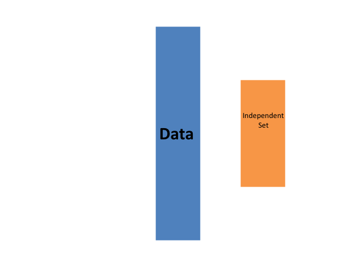
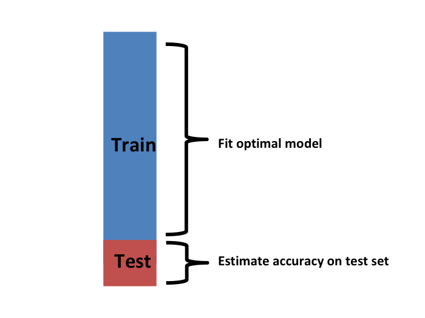

---
title       : Cross-Validation
author      : Adam J Sullivan 
job         : Assistant Professor of Biostatistics
work        : Brown University
framework   : io2012        # {io2012, html5slides, shower, dzslides, ...}
highlighter : highlight.js # {highlight.js, prettify, highlight}
hitheme     :  github     # 
widgets     : [mathjax, quiz, bootstrap, interactive] # {mathjax, quiz, bootstrap}
ext_widgets : {rCharts: [libraries/nvd3, libraries/leaflet, libraries/dygraphs]}
mode        : selfcontained # {standalone, draft}
knit        : slidify::knit2slides
logo        : publichealthlogo.png
biglogo     : publichealthlogo.png
assets      : {assets: ../../assets}
---  .segue bg:grey


# Cross validation 

--- .class #id

## Cross Validation

- One important concept in statistics and data science is cross validation. 
- This method can help us understand the errors present in our data. 
- It is often used for predictive modeling and validating other models. 

--- .class #id

## Motivation with k-nearest neighbors 

- We will begin by considering the concept of k-nearest neighbors. 
- Let's explore some data first. 


```r
library(tidyverse)
library(dslabs)
data("mnist_27")
mnist_27$test%>% ggplot(aes(x_1, x_2, color = y)) +  geom_point()
```


--- .class #id

## Motivation with k-nearest neighbors 


--- .class #id

## Why K-Nearest Neighbors

- This is a non-parametric classification method.
- We can use this to help separate out values. 
- In practice this can be used to match a new value with the closest old values. 


--- .class #id

## What are we doing?

- We will use these data to estimate the conditional probability function 
$$
p(x_1, x_2) = \mbox{Pr}(Y=1 \mid X_1=x_1 , X_2 = x_2).
$$

--- .class #id

## How do we do this?

- First we define the distance between all observations based on the features. 
- Then, for any point $(x_1,x_2)$ for which we want an estimate of $p(x_1, x_2)$, we look for the $k$ nearest points to $(x_1,x_2)$ and then take an average of the 0s and 1s associated with these points. 
- We refer to the set of points used to compute the average as the _neighborhood_.
- The larger your $k$, the smoother the estimates. 

--- .class #id

## `caret` package in R

- To implement the algorithm, we can use the `knn3` function from the __caret__ package. 


```r
library(caret)
knn_fit <- knn3(y ~ ., data = mnist_27$train, k=5)
```

--- .class #id

## What do we get ? 

- The `predict` function for `knn` produces a probability for each class.
- We keep the probability of being a 7 as the estimate $\hat{p}(x_1, x_2)$

```r
y_hat_knn <- predict(knn_fit, mnist_27$test, type = "class")
confusionMatrix(data = y_hat_knn, reference = mnist_27$test$y)$overall["Accuracy"]
```


--- .class #id

## What do we get ? 


```
## Accuracy 
##    0.815
```


--- .class #id

## Comparison to Linear Regression

- Let's see if linear regression could work: 


```r
fit_lm <- mnist_27$train %>% mutate(y = ifelse(y == 7, 1, 0)) %>% lm(y ~ x_1 + x_2, data = .)
p_hat_lm <- predict(fit_lm, mnist_27$test)
y_hat_lm <- factor(ifelse(p_hat_lm > 0.5, 7, 2))
confusionMatrix(data = y_hat_lm, reference = mnist_27$test$y)$overall["Accuracy"]
```


--- .class #id

## Comparison to Linear Regression


```
## Accuracy 
##     0.75
```

--- .class #id

## Comparison to Linear Regression
  
- kNN doe better than regression.
-  To see why this is case, we will plot $\hat{p}(x_1, x_2)$ and compare it to the the true conditional probability $p(x_1, x_2)$:


--- .class #id

## Comparison Plots


--- .class #id

## Why does it work? 

- We can see that the relationship is non-linear. 
- Some of our areas and colors do not make sense though. 
- This is what we call overfitting. 
- Over-fitting is when the result works really well in one set of data but not as well in newer data. 

--- .class #id

## Viewing Overfitting


```r
y_hat_knn <- predict(knn_fit, mnist_27$train, type = "class")
confusionMatrix(data = y_hat_knn, reference = mnist_27$train$y)$overall["Accuracy"]

y_hat_knn <- predict(knn_fit, mnist_27$test, type = "class")
confusionMatrix(data = y_hat_knn, reference = mnist_27$test$y)$overall["Accuracy"]
```

```
## Accuracy 
##    0.882 
## Accuracy 
##    0.815
```


--- .class #id

## Over-fitting

- Over-fitting with kNN is the worst when $k=1$. 
- This is because the estimate for each $(x_1, x_2)$ in the training set is obtained with just the $y$ corresponding to that point. 
- In this case, if the $(x_1, x_2)$ are unique, we will obtain perfect accuracy in the training set because each point is used to predict itself. 
- however, this will fail if the new points are not in the training set. 


--- .class #id

## kNN with $k=1$


```r
knn_fit_1 <- knn3(y ~ ., data = mnist_27$train, k = 1)
y_hat_knn_1 <- predict(knn_fit_1, mnist_27$train, type = "class")
confusionMatrix(data=y_hat_knn_1, reference=mnist_27$train$y)$overall[["Accuracy"]]
```

```
## [1] 0.998
```

--- .class #id

## What about the test accuracy?


```r
y_hat_knn_1 <- predict(knn_fit_1, mnist_27$test, type = "class")
confusionMatrix(data=y_hat_knn_1, reference=mnist_27$test$y)$overall["Accuracy"]
```

```
## Accuracy 
##    0.735
```


--- .class #id

## Picturing over-fitting


--- .class #id

## What can we see?

- The estimate $\hat{p}(x_1, x_2)$ follows the training data too closely (left). 
- You can see that in the training set, boundaries have been drawn to perfectly surround a single red point in a sea of blue. 
- Because most points $(x_1, x_2)$ are unique, the prediction is either 1 or 0 and the prediction for that point is the associated label. 
- However, once we introduce the training set (right), we see that many of these small islands now have the opposite color and we end up making several incorrect predictions.

--- .class #id

## Over-smoothing

- Although not as badly as with the previous examples, we saw that with $k=5$ we also over-trained.
- Hence, we should consider a larger $k$. 
- Let's try, as an example, a much larger number: $k=401$. 

--- .class #id

## Over-smoothing


```r
knn_fit_401 <- knn3(y ~ ., data = mnist_27$train, k = 401)
y_hat_knn_401 <- predict(knn_fit_401, mnist_27$test, type = "class")
confusionMatrix(data=y_hat_knn_401, reference=mnist_27$test$y)$overall["Accuracy"]
```

```
## Accuracy 
##     0.79
```

--- .class #id


## Large $k$ vs Linear

- This turns out to be similar to regression:
  


--- .class #id


## Large $k$ vs Linear

- This size of $k$ is so large that it does not permit enough flexibility. 
- We call this _over-smoothing_. 

--- .class #id

## Picking the $k$ in kNN

- So how do we pick $k$? 
- In principle we want to pick the $k$ that maximizes accuracy, or minimizes the expected MSE.
- The goal of cross validation is to estimate these quantities for any given algorithm and set of tuning parameters such as $k$. 
- To understand why we need a special method to do this let's repeat what we did above but for different values of $k$:


--- .class #id

## Coding

- Sequence of ks

```r
ks <- seq(3, 251, 2)
```
- We do this using  `map_df` function to repeat the above for each one. 


--- .class #id 


## Coding


```r
library(caret)
library(purrr)
library(tidyverse)
accuracy <- map_df(ks, function(k){
  fit <- knn3(y ~ ., data = mnist_27$train, k = k)
  
  y_hat <- predict(fit, mnist_27$train, type = "class")
  cm_train <- confusionMatrix(data = y_hat, reference = mnist_27$train$y)
  train_error <- cm_train$overall["Accuracy"]
  
  y_hat <- predict(fit, mnist_27$test, type = "class")
  cm_test <- confusionMatrix(data = y_hat, reference = mnist_27$test$y)
  test_error <- cm_test$overall["Accuracy"]
  
  tibble(train = train_error, test = test_error)
})
```


--- .class #id

## Plotting accuracy

- Note that we estimate accuracy by using both the training set and the test set. 
- We can now plot the accuracy estimates for each value of $k$:


--- .class #id

## What can we see?

- The estimate obtained on the training set is generally higher than the estimate obtained with the test set, with the difference larger for smaller values of $k$. 
- This is due to over-fitting Also note that the accuracy versus $k$ plot is quite jagged.
- We do not expect this because small changes in $k$ should not affect the algorithm's performance too much. 
- The jaggedness is explained by the fact that the accuracy is computed on a sample and therefore is a random variable.
- This demonstrates why we prefer to minimize the expected loss rather than the loss we observe with one dataset. 


--- .class #id

## Different $k$

- If we were to use these estimate to pick the $k$ that maximizes accuracy, we would use the estimates built on the test data:

```r
ks[which.max(accuracy$test)]
max(accuracy$test)
```

```
## [1] 41
## [1] 0.86
```
- Another reason we need a better estimate of accuracy is that if we use the test set to pick this $k$, we we not should expect the accompanying accuracy estimate to extrapolate to the real world. 
- This is because even here we broke a golden rule of machine learning: we selected the $k$ using the test set. 
- Cross validation also provides an estimate that takes this into account.


--- .class #id

## Mathematical description of cross validation

- When we introduced liner regression we said one goal was to minimize the MSE. 
$$
\mbox{MSE} = \mbox{E}\left\{ \frac{1}{N}\sum_{i=1}^N (\hat{Y}_i - Y_i)^2 \right\}
$$
- When all we have at our disposal is one dataset, we can estimate the MSE with the observed MSE like this:
$$
\hat{\mbox{MSE}} = \frac{1}{N}\sum_{i=1}^N (\hat{y}_i - y_i)^2
$$
- These two are often referred to as the _true error_ and _apparent error_ respectively.


--- .class #id 

## Apparent Error


1. Because our data is random, the apparent error is a random variable. 
2. If we train an algorithm on the same dataset that we use to compute the apparent error, we might be overfitting 
    - In general, when we do this, the apparent error will be an underestimate of the true error. 
    - We will see an extreme example of this with k nearest neighbors.


--- .class #id

## Cross validation

- Cross validation is a technique that permits us to alleviate both these problems. 
- To understand cross validation, it helps to think of the true error, a theoretical quantity, as the average of many apparent errors obtained by applying the algorithm to $B$ new random samples of the data, none of them used to train the algorithm. 
- We think of the true error as:

$$
\frac{1}{B} \sum_{b=1}^B \frac{1}{N}\sum_{i=1}^N \left(\hat{y}_i^b - y_i^b\right)^2 
$$

--- .class #id

## Cross validation

- with $B$ a large number that can be thought of as practically infinite. 
- As already mentioned, this is a theoretical quantity because we only have available one set of outcomes: $y_1, \dots, y_n$. 
- Cross validation is based on the idea of imitating the theoretical setup above as best we can with the data we have. 

--- .class #id

## Cross Validation

- To do this, we have to generate a series of different random samples. 
- There are several approaches we can use, but the general idea for all of them is to randomly generate smaller datasets that are not used for training, and instead used to estimate the true error.


--- .class #id

## K-fold cross validation

- We begin with a dataset that we work with (blue) and we wish to test on a completely new dataset (yellow)



--- .class #id

## Reality Check

- We typically never get to see the yellow when building the model. 
- So to imitate this situation, we carve out a piece of our dataset and pretend it is an independent dataset.
- we divide the dataset into a _training set_ (blue) and a _test set_ (red). 
- We will train our models exclusively on the training set and use the test set only for evaluation purposes.


--- .class #id

## Reality Check


--- .class #id

## How do we do this?

- We usually try to select a small piece of the dataset so that we have as much data as possible to train. 
- However, we also want the test set to be large so that we obtain a stable estimate of the loss without fitting an impractical number of models. 
- Typical choices are to use 10%-20% of the data for testing. 
- For each set of model parameters being considered, we we want an estimate of the MSE and then we will chose the parameters with the smallest MSE. 
- Cross validation provides this estimate.


--- .class #id

## Cross Validation

- 
First, before we start the cross validation procedure, it is important to fix all the algorithm parameters. 
- Although we will train the algorithm on the set of training sets, the parameters $\lambda$ will be the same across all training sets.
- We will use $\hat{y}_i(\lambda)$ to denote the predictors obtained when we use parameters $\lambda$.


--- .class #id

## Cross Validation

- So, if we are going to imitate this definition:
$$
\mbox{MSE}(\lambda) = \frac{1}{B} \sum_{b=1}^B \frac{1}{N}\sum_{i=1}^N \left(\hat{y}_i^b(\lambda) - y_i^b\right)^2 
$$
- we want to consider datasets that can be thought of as an independent random sample and we want to do this several times. 
- With K-fold cross validation, we do it $K$ times. 

--- .class #id

## How?

- We will eventually end up with $K$ samples, but let's start by describing how to construct the first:
-  we simply pick $M=N/K$ observations at random (we round if $M$ is not a round number) and think of these as a random sample $y_1^b, \dots, y_M^b$, with $b=1$. 
- We call this the validation set:


--- .class #id 

## Validation Set


--- .class #id

## Fit Model in Training Set

- Now we can fit the model in the training set, then compute the apparent error on the independent set:
$$
\hat{\mbox{MSE}}_b(\lambda) = \frac{1}{M}\sum_{i=1}^M \left(\hat{y}_i^b(\lambda) - y_i^b\right)^2 
$$

--- .class #id

## Problems?

- Note that this is just one sample and will therefore return a noisy estimate of the true error.
- This is why we take $K$ samples, not just one. 
- In K-cross validation, we randomly split the observations into $K$ non-overlapping sets:


--- .class #id


--- .class #id

## Repeat

- Now we repeat the calculation above for each of these sets $b=1,\dots,K$ and obtain $\hat{\mbox{MSE}}_1(\lambda),\dots, \hat{\mbox{MSE}}_K(\lambda)$. 
- Then, for our final estimate, we compute the average:
$$
\hat{\mbox{MSE}}(\lambda) = \frac{1}{B} \sum_{b=1}^K \hat{\mbox{MSE}}_b(\lambda)
$$
- A final step would be to select the $\lambda$ that minimizes the MSE.


--- .class #id

## Notes

- We now have to take into account the fact that the optimization occurred on the training data and therefore we need an estimate of our final algorithm based on data that was not used to optimize the choice. 
- Here is where we use the test set we separated early on:


--- .class #id




--- .class #id

## Cross Validation 

- We can do cross validation again:


--- .class #id

## Final Notes


- note that this means that our entire compute time gets multiplied by $K$.
- You will soon learn that performing this task takes time because we are performing many complex computations. 
- As a result, we are always looking for ways to reduce this time. 
- For the final evaluation, we often just use the one test set.


--- .class #id

## How do we pick k?

-  Large values of $K$ are preferable because the training data better imitates the original dataset. 
- However, larger values of $K$ will have much slower computation time: for example, 100-fold cross validation will be 10 times slower than 10-fold cross validation. 
- For this reason, the choices of $K=5$ and $K=10$ are popular.

--- .class #id

## Improving on Estimates?

- One way we can improve the variance of our final estimate is to take more samples. 
- To do this, we would no longer require the training set to be partitioned into non-overlapping sets. 
- Instead, we would just pick $K$ sets of some size at random.


--- .class #id

## Improving Estimates

- One popular version of this technique, at each fold, picks observations at random with replacement (which means the same observation can appear twice).
- This approach has some advantages (not discussed here) and is generally referred to as the _Bootstrap_.
- In fact, this is the default approach in the __caret__ package.  
