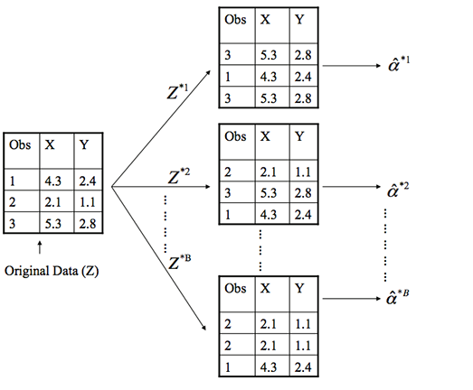
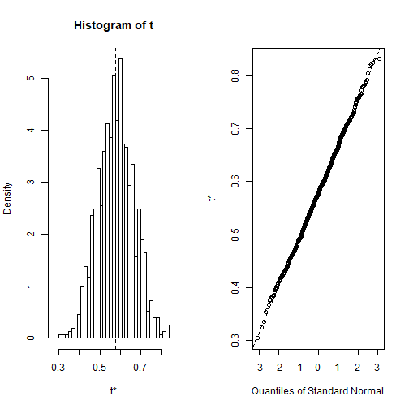

---
title       : Bootstrapping
author      : Adam J Sullivan 
job         : Assistant Professor of Biostatistics
work        : Brown University
framework   : io2012        # {io2012, html5slides, shower, dzslides, ...}
highlighter : highlight.js # {highlight.js, prettify, highlight}
hitheme     :  github     # 
widgets     : [mathjax, quiz, bootstrap, interactive] # {mathjax, quiz, bootstrap}
ext_widgets : {rCharts: [libraries/nvd3, libraries/leaflet, libraries/dygraphs]}
mode        : selfcontained # {standalone, draft}
knit        : slidify::knit2slides
logo        : publichealthlogo.png
biglogo     : publichealthlogo.png
assets      : {assets: ../../assets}
---  .segue bg:grey


# Resampling Methods


--- .class #id

## Resampling Methods

- Very popular tool in modern statistics. 
- Involvees drawing samples from data and calculating statistics in the sample. 
- Quick Example: Getting standard error and confidence intervals for non-normal data in linear regression

--- .class #id

## Resampling Methods





--- .class #id


## Why Resampling

- SO far we have been using the *validation* or *hold-out* approach to estimate the prediction error of our predictive models. 
- This involves randomly dividing the available set of observations into two parts, a *training set* and a *testing set* (aka *validation set*).
- Our statistical model is fit on the training set, and the fitted model is used to predict the responses for the observations in the validation set.


--- .class #id


## Why Resampling


- The resulting validation set error rate (typically assessed using MSE in the case of a quantitative response) provides an estimate of the test error rate.  
- The validation set approach is conceptually simple and is easy to implement. But it has two potential drawbacks:


--- .class #id


## Bootstrapping 

- *Bootstrapping* is a widely applicable and extremely powerful statistical tool that can be used to quantify the uncertainty associated with a given estimator or statistical learning method.
- As a simple example, bootstraping can be used to estimate the standard errors of the coefficients from a linear regression fit.
- This may not seem necessary because we already achieve these through R, but bootstrapping may yield better standard errors. 


--- .class #id


## Bootstrapping


- Other statistical methods are not as simple to get errors from. 
- Bootstrapping can be a great way to understand variability. 


--- .class #id

## What does it do?

- Basically, bootstrapping treats the data as a population. 
- The we repeatedly draw independent samples to create *bootstrapped* datasets. 
- We sample with replacement, allowing observations to be sampled more than once. 


--- .class #id


--- .class #id

## How do we do this?

- Each bootstrap data set $$Z^{*1}, Z^{*2}, \dots, Z^{*B}$$ contains *n* observations, sampled with replacement from the original data set.  
- Each bootstrap is used to compute the estimated statistic we are interested in $\hat\alpha^*$. 


--- .class #id

## Then what?

- We can then use all the bootstrapped data sets to compute the standard error of $$\hat\alpha^{*1}, \hat\alpha^{*2}, \dots, \hat\alpha^{*B}$$ desired statistic as
$$ SE_B(\hat\alpha) = \sqrt{\frac{1}{B-1}\sum^B_{r=1}\bigg(\hat\alpha^{*r}-\frac{1}{B}\sum^B_{r'=1}\hat\alpha^{*r'}\bigg)^2}  \tag{4} $$
- $$SE_B(\hat\alpha)$$ serves as an estimate of the standard error of $$\hat\alpha$$ estimated from the original data set. 

--- .class #id

## Example 1: Estimating the accuracy of a single statistic

- Performing a bootstrap analysis in R entails two steps:
    1. Create a function that computes the statistic of interest.
    2. Use the `boot` function from the [`boot`](http://cran.r-project.org/web/packages/boot/index.html) package to perform the boostrapping

--- .class #id


## The Data

- In this example we'll use the `ISLR::Portfolio` data set.  
- This data set contains the returns for two investment assets (*X* and *Y*). 


--- .class #id


## The Goal

- Here, our goal is going to be minimizing the risk of investing a fixed sum of money in each asset.  
- Mathematically, we can achieve this by minimizing the variance of our investment using the statistic
$$ \hat\alpha = \frac{\hat\sigma^2_Y - \hat\sigma_{XY}}{\hat\sigma^2_X +\hat\sigma^2_Y-2\hat\sigma_{XY}}  \tag{5} $$
- Thus, we need to create a function that will compute this test statistic:


--- .class #id

## The Function


```r
statistic <- function(data, index) {
  x <- data$X[index]
  y <- data$Y[index]
  (var(y) - cov(x, y)) / (var(x) + var(y) - 2* cov(x, y))
}
```


--- .class #id

## Computing


- Now we can compute $$\hat\alpha$$ for a specified subset of our portfolio data:


```r
portfolio <- ISLR::Portfolio
statistic(portfolio, 1:100)
```

```
## [1] 0.576
```


--- .class #id

## How does Bootstrapping work?

- 
Next, we can use `sample` to randomly select 100 observations from the range 1 to 100, with replacement. 
- This is equivalent to constructing a new bootstrap data set and recomputing $$\hat\alpha$$ based on the new data set.  


```r
statistic(portfolio, sample(100, 100, replace = TRUE))
```

```
## [1] 0.467
```


--- .class #id

## What do we see?

- If you re-ran this function several times you'll see that you are getting a different output each time.  
- What we want to do is run this *many* times, record our output each time, and then compute a valid standard error of all the outputs. 
- To do this we can use `boot` and supply it our original data, the function that computes the test statistic, and the number of bootstrap replicates (`R`).


--- .class #id

## `boot()` function in R


```r
set.seed(123)
boot(portfolio, statistic, R = 1000)
```

--- .class #id

## `boot()` function in R


```
## 
## ORDINARY NONPARAMETRIC BOOTSTRAP
## 
## 
## Call:
## boot(data = portfolio, statistic = statistic, R = 1000)
## 
## 
## Bootstrap Statistics :
##     original  bias    std. error
## t1*    0.576  0.0024      0.0875
```


--- .class #id

## What do we get? 

- The final output shows that using the original data, $$\hat\alpha = 0.5758$$, and it also provides the bootstrap estimate of our standard error $$SE(\hat\alpha) = 0.0875$$.
- Once we generate the bootstrap estimates we can also view the confidence intervals with `boot.ci` and plot our results:


--- .classs #id

## R Code


```r
set.seed(123)
result <- boot(portfolio, statistic, R = 1000)

boot.ci(result, type = "basic")
```

--- .class #id

## R Code


```
## BOOTSTRAP CONFIDENCE INTERVAL CALCULATIONS
## Based on 1000 bootstrap replicates
## 
## CALL : 
## boot.ci(boot.out = result, type = "basic")
## 
## Intervals : 
## Level      Basic         
## 95%   ( 0.396,  0.738 )  
## Calculations and Intervals on Original Scale
```

--- .class #id


## Plot of Results





--- .class #id


## Example 2: Estimating the accuracy of a linear regression model


- We can use this same concept to assess the variability of the coefficient estimates and predictions from a statistical learning method such as linear regression. 
- For instance, here we'll assess the variability of the estimates for $$\beta_0$$ and $$\beta_1$$, the intercept and slope terms for the linear regression model that uses `horsepower` to predict `mpg` in our `auto` data set.  


--- .class #id

## The Function


- First, we create the function to compute the statistic of interest. 
- We can apply this to our entire data set to get the baseline coefficients.


```r
library(tidyverse)
auto <- as_tibble(ISLR::Auto)
statistic <- function(data, index) {
  lm.fit <- lm(mpg ~ horsepower, data = data, subset = index)
  coef(lm.fit)
}
```


--- .class #id

## What do we get?


```r
statistic(auto, 1:392)
```

```
## (Intercept)  horsepower 
##      39.936      -0.158
```


--- .class #id

## Then use `boot()`


```r
set.seed(123)
boot(auto, statistic, 1000)
```


--- .class #id


## The Results


```
## 
## ORDINARY NONPARAMETRIC BOOTSTRAP
## 
## 
## Call:
## boot(data = auto, statistic = statistic, R = 1000)
## 
## 
## Bootstrap Statistics :
##     original    bias    std. error
## t1*   39.936  0.029596      0.8635
## t2*   -0.158 -0.000294      0.0076
```


--- .class #id

## What can we conclude?

- This indicates that the bootstrap estimate for $SE(\beta_0)$ is 0.86, and that the bootstrap estimate for $SE(\beta_1)$ is 0.0076. 
- If we compare these to the standard errors provided by the `summary` function we see a difference.  


--- .class #id

## The summary


```
## 
## Call:
## lm(formula = mpg ~ horsepower, data = auto)
## 
## Residuals:
##     Min      1Q  Median      3Q     Max 
## -13.571  -3.259  -0.344   2.763  16.924 
## 
## Coefficients:
##             Estimate Std. Error t value Pr(>|t|)    
## (Intercept) 39.93586    0.71750    55.7   <2e-16 ***
## horsepower  -0.15784    0.00645   -24.5   <2e-16 ***
## ---
## Signif. codes:  0 '***' 0.001 '**' 0.01 '*' 0.05 '.' 0.1 ' ' 1
## 
## Residual standard error: 4.91 on 390 degrees of freedom
## Multiple R-squared:  0.606,	Adjusted R-squared:  0.605 
## F-statistic:  600 on 1 and 390 DF,  p-value: <2e-16
```


--- .class #id

## What does this mean?

- This difference suggests the standard errors provided by `summary` may be biased. 
- That is, certain assumptions may be violated which is causing the standard errors in the non-bootstrap approach to be different than those in the bootstrap approach.
- This may be due to the fact that this might be better modeled by a quadratic. 


--- .class #id


## Quadratic Function


```r
quad.statistic <- function(data, index) {
  lm.fit <- lm(mpg ~ poly(horsepower, 2), data = data, subset = index)
  coef(lm.fit)
}
```


--- .class #id

## Boot it


```r
set.seed(1)
boot(auto, quad.statistic, 1000)
```

--- .class #id

## Boot it


```
## 
## ORDINARY NONPARAMETRIC BOOTSTRAP
## 
## 
## Call:
## boot(data = auto, statistic = quad.statistic, R = 1000)
## 
## 
## Bootstrap Statistics :
##     original  bias    std. error
## t1*     23.4 0.00394       0.226
## t2*   -120.1 0.11731       3.701
## t3*     44.1 0.04745       4.329
```


--- .class #id

## What do we get?

- Now if we compare the standard errors between the bootstrap approach and the non-bootstrap approach we see the standard errors align more closely.  
- This better correspondence between the bootstrap estimates and the standard estimates suggest a better model fit.  
- Thus, bootstrapping provides an additional method for assessing the adequacy of our model's fit.


--- .class #id


## Summary in R


```
## 
## Call:
## lm(formula = mpg ~ poly(horsepower, 2), data = auto)
## 
## Residuals:
##     Min      1Q  Median      3Q     Max 
## -14.714  -2.594  -0.086   2.287  15.896 
## 
## Coefficients:
##                      Estimate Std. Error t value Pr(>|t|)    
## (Intercept)            23.446      0.221   106.1   <2e-16 ***
## poly(horsepower, 2)1 -120.138      4.374   -27.5   <2e-16 ***
## poly(horsepower, 2)2   44.090      4.374    10.1   <2e-16 ***
## ---
## Signif. codes:  0 '***' 0.001 '**' 0.01 '*' 0.05 '.' 0.1 ' ' 1
## 
## Residual standard error: 4.37 on 389 degrees of freedom
## Multiple R-squared:  0.688,	Adjusted R-squared:  0.686 
## F-statistic:  428 on 2 and 389 DF,  p-value: <2e-16
```

