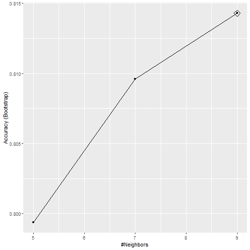
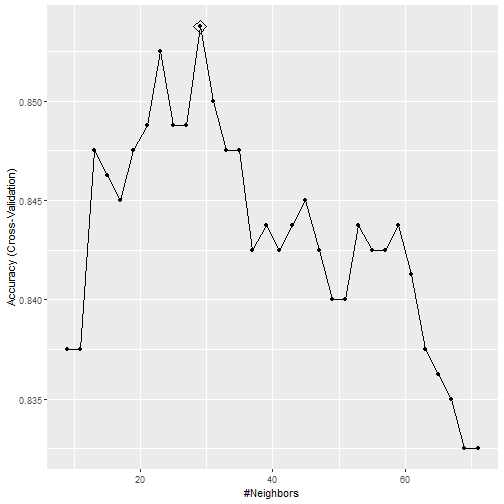

---
title       : CV in Action
author      : Adam J Sullivan 
job         : Assistant Professor of Biostatistics
work        : Brown University
framework   : io2012        # {io2012, html5slides, shower, dzslides, ...}
highlighter : highlight.js # {highlight.js, prettify, highlight}
hitheme     :  github     # 
widgets     : [mathjax, quiz, bootstrap, interactive] # {mathjax, quiz, bootstrap}
ext_widgets : {rCharts: [libraries/nvd3, libraries/leaflet, libraries/dygraphs]}
mode        : selfcontained # {standalone, draft}
knit        : slidify::knit2slides
logo        : publichealthlogo.png
biglogo     : publichealthlogo.png
assets      : {assets: ../../assets}
---  .segue bg:grey


# Cross Validation in Action

--- .class #id

## Cross Validation in Action


- We have focused on regression mostly in this class. 
- Recently we have discussed other concepts like CV and Bootstrapping. 
- We will now see how to do CV in the real world. 

--- .class #id

## The `caret()` package


- `caret` i short for **C**lassification And **RE**gression **T**raining
- You can read more in depth about it [here](https://topepo.github.io/caret/index.html).
- We will use it to help with CV. 


--- .class #id 

## Read the Data


```r
library(tidyverse)
library(dslabs)
data("mnist_27")
```


--- .class #id

## The caret `train` functon 

- The __caret__ `train` function lets us train different algorithms using similar syntax. 
- So, for example, we can type:


```r
library(caret)
train_glm <- train(y ~ ., method = "glm", data = mnist_27$train)
train_knn <- train(y ~ ., method = "knn", data = mnist_27$train)
```


--- .class #id

## What do we get?


```
## Generalized Linear Model 
## 
## 800 samples
##   2 predictor
##   2 classes: '2', '7' 
## 
## No pre-processing
## Resampling: Bootstrapped (25 reps) 
## Summary of sample sizes: 800, 800, 800, 800, 800, 800, ... 
## Resampling results:
## 
##   Accuracy  Kappa
##   0.795     0.588
```


--- .class #id

## What do we get?


```
## k-Nearest Neighbors 
## 
## 800 samples
##   2 predictor
##   2 classes: '2', '7' 
## 
## No pre-processing
## Resampling: Bootstrapped (25 reps) 
## Summary of sample sizes: 800, 800, 800, 800, 800, 800, ... 
## Resampling results across tuning parameters:
## 
##   k  Accuracy  Kappa
##   5  0.797     0.592
##   7  0.812     0.623
##   9  0.818     0.634
## 
## Accuracy was used to select the optimal model using the largest value.
## The final value used for the model was k = 9.
```


--- .classs #id

## Why use `caret` `train()` function?

- Normally o make predictions we need to use a  `predict.glm` and `predict.knn`. 
- Instead, we can learn how to obtain predictions from `predict.train`.
- The code looks the same for both methods:

```r
y_hat_glm <- predict(train_glm, mnist_27$test, type = "raw")
y_hat_knn <- predict(train_knn, mnist_27$test, type = "raw")
```


--- .class #id

## How does this help?

- We can quickly code using the same syntax. 
- We can also easily compare accuracy. 


--- .class #id

## Accuracy Comparison


```r
confusionMatrix(y_hat_glm, mnist_27$test$y)$overall[["Accuracy"]]
confusionMatrix(y_hat_knn, mnist_27$test$y)$overall[["Accuracy"]]
```

```
## [1] 0.75
## [1] 0.84
```

--- .class #id

## Cross validation 

- When an algorithm includes a tuning parameter, `train` automatically uses cross validation to decide among a few default values. 
- To find out what parameter or parameters are optimized, you can read [this](http://topepo.github.io/caret/available-models.html) or study the output of: 


```r
getModelInfo("knn")
```

--- .class #id

## Model Info

- We can also use a quick lookup like this:


```r
modelLookup("knn")
```


--- .class #id

## Running K Nearest Neighbors


```r
train_knn <- train(y ~ ., method = "knn", data = mnist_27$train)
```


--- .class #id

## What can we see?





--- .class #id

## What Happened?

- By default, the cross validation is performed by taking 25 bootstrap samples comprised of 25% of the observations.
- For the `kNN` method, the default is to try $k=5,7,9$. 
- We change this using the `tuneGrid` parameter. 
- The grid of values must be supplied by a data frame with the parameter names as specified in the `modelLookup` output. 


--- .class #id

## Seting the grid

- We can try the values we did previously between 3 and 251 
-  To do this with __caret__, we need to define a column named `k`, so we use this: 
`data.frame(k = seq(3, 251, 2))`.


--- .class #id

## What is happening


- We are fitting 125 versions of the knn
- we do this over 25 bootstrap samples of daa. 
- We are then fitting $125 \times 25 = 3125$ models. 
- This will take a bit to run. 


--- .class #id

## The code


```r
set.seed(2008)
train_knn <- train(y ~ ., method = "knn", 
                   data = mnist_27$train,
                   tuneGrid = data.frame(k = seq(2, 251, 2)))
ggplot(train_knn, highlight = TRUE)
```


--- .class #id

## The code


--- .class

## Accuracy

- To access the parameter that maximized the accuracy, you can use this:


```r
train_knn$bestTune
```

```
##     k
## 17 34
```

--- .class #id

## Best performing Model

- We can access the best performing model as below:


```r
train_knn$finalModel
```

```
## 34-nearest neighbor model
## Training set outcome distribution:
## 
##   2   7 
## 379 421
```


--- .class #id

## Predicting

- The function `predict` will use this best performing model. 
- Here is the accuracy of the best model when applied to the test set, which we have not used at all yet because the cross validation was done on the training set:


```r
confusionMatrix(predict(train_knn, mnist_27$test, type = "raw"),
                mnist_27$test$y)$overall["Accuracy"]
```

```
## Accuracy 
##     0.85
```


--- .class #id

## Further Modeifications to code

- If we want to change how we perform cross validation, we can use the `trainControl` function.
-  We can make the code above go a bit faster by using, for example, 10-fold cross validation. 
- This means we have 10 samples using 10% of the observations each. 
- We accomplish this using the following code:
  
  

--- .class #id

## The Code


```r
control <- trainControl(method = "cv", number = 10, p = .9)
train_knn_cv <- train(y ~ ., method = "knn", 
                   data = mnist_27$train,
                   tuneGrid = data.frame(k = seq(9, 71, 2)),
                   trControl = control)
ggplot(train_knn_cv, highlight = TRUE)
```


--- .class #id


## What can we see?




--- .class #id

## What can we see?

- We notice that the accuracy estimates are more variable, which is expected since we changed the number of samples used to estimate accuracy.
- We can also see the standard deviation bars obtained from the cross validation samples:


```r
train_knn$results %>% 
  ggplot(aes(x = k, y = Accuracy)) +
  geom_line() +
  geom_point() +
  geom_errorbar(aes(x = k, 
                    ymin = Accuracy - AccuracySD, 
                    ymax = Accuracy + AccuracySD))
```


--- .class #id

## Error Bars


--- .class

## Conditional Probability


- The best fitting kNN model approximates the true conditional probability:


--- .class #id 

## Conclusion


- However, we do see that the boundary is somewhat wiggly.
- This is because kNN, like the basic bin smoother, does not use a kernel. 
- To improve this we could try loess.


--- .class #id

## loess Example

- We will need to use the `gam` package. 
- We can consider the model with the code below. 
- From this we find that there are 2 parameters to optimize. 

--- .class #id

## loess Example


```r
modelLookup("gamLoess")
```

```
##      model parameter  label forReg forClass probModel
## 1 gamLoess      span   Span   TRUE     TRUE      TRUE
## 2 gamLoess    degree Degree   TRUE     TRUE      TRUE
```

--- .class #id

## Simplification

- We will just do 1 degree. 
- This means a polynomial of 1 degree. 
- Then we will consider different values of span
- We must mention degree in our grid to do this. 


--- .class #id

## Our grid


```r
grid <- expand.grid(span = seq(0.15, 0.65, len = 10), degree = 1)
grid
```

```
##     span degree
## 1  0.150      1
## 2  0.206      1
## 3  0.261      1
## 4  0.317      1
## 5  0.372      1
## 6  0.428      1
## 7  0.483      1
## 8  0.539      1
## 9  0.594      1
## 10 0.650      1
```


--- .class #id

## CV code


```r
train_loess <- train(y ~ ., 
                   method = "gamLoess", 
                   tuneGrid=grid,
                   data = mnist_27$train)
ggplot(train_loess, highlight = TRUE)
```


--- .class #id

## CV Results


--- .class #id

## How does it Perform?

- Performs similar to knn

```r
confusionMatrix(data = predict(train_loess, mnist_27$test), 
                reference = mnist_27$test$y)$overall["Accuracy"]
```

```
## Accuracy 
##    0.845
```


--- .class #id

## Conditional Probability

- This is more smooth


