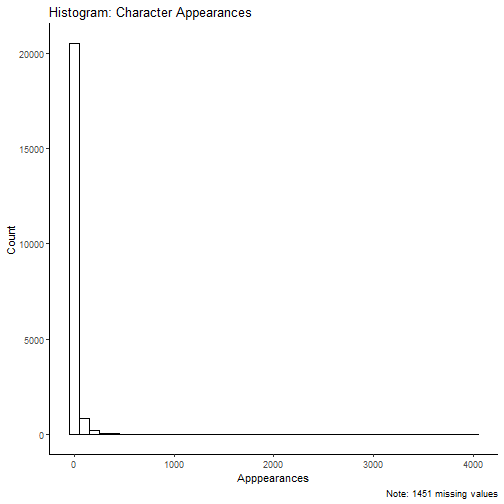
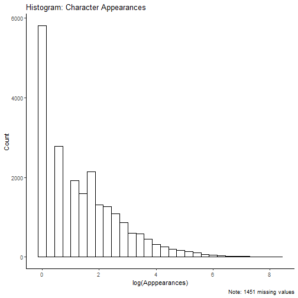
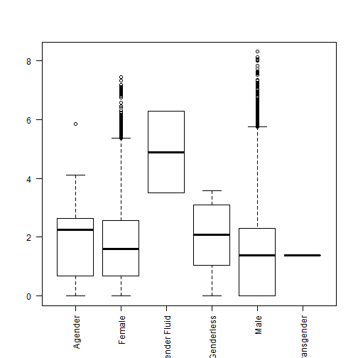
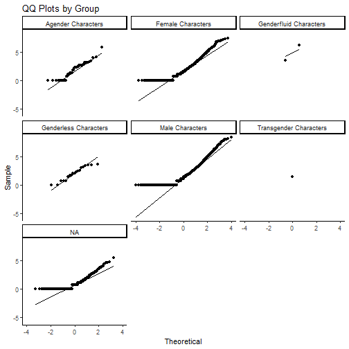

***For the R Markdown Version of the solutions: [RMarkdown](https://raw.githubusercontent.com/php-1511-2511/php-1511-2511.github.io/master/homework/hw1_sol.Rmd)***

We will consider the data behind the story: ["Comic Books are Still Made By Men, For Men and About Men"](http://fivethirtyeight.com/features/women-in-comic-books/). This data is part of the `fivethirtyeight` package. To use this data you can run the following code:


## Questions

It is obvious that this is not directly a public health dataset but in society at large we can notice that there are a lot of inequities and biases that are interwoven into mast aspects of life. This includes something as simple as comic book characters. This homework will give you a chance to evaluate basic statistical methods you learned previously and practice improving your R coding. 


1. We will evaluate the number of appearances as the outcome. Create a plot to display the distribution of this variable. Then interpret the graph and note the normality, skewness and anything else you notice about this. 


### Range of Appearances

| min|  max|
|---:|----:|
|   1| 4043|


### Missing Data for Appearances


|is.na(appearances) |     n|
|:------------------|-----:|
|FALSE              | 21821|
|TRUE               |  1451|


###Histogram of appearances





$\color{blue}{\text{Answer:}}$

  ***The distribution of appearances is highly right-skewed. The values that the variable takes on range from 1 to 4043 and the variable includes 1451 missing values. There tail of the distribution contains few very high values. The appearance variable is also bounded by 0***


2. Hopefully you noted that this was not normally distributed so the next step would be to consider a `log` transform of this variable. Use the `mutate()` function to add a variable `log_app` which is the log of the appearances. Then create the same distribution plot above for `log_app`.



$\color{blue}{\text{Answer:}}$
  
***The distribution of log appearances is still right-skewed, but less so than it was prior to the log transformation.***
  

3. We will now consider the variable `sex` in the dataset. Make a table of counts of how many characters are in each group. You can use `tally()` or `count()` for this. Comment on what you notice about these groups. 


<table>
 <thead>
  <tr>
   <th style="text-align:left;"> sex </th>
   <th style="text-align:right;"> n </th>
  </tr>
 </thead>
<tbody>
  <tr>
   <td style="text-align:left;"> Agender Characters </td>
   <td style="text-align:right;"> 45 </td>
  </tr>
  <tr>
   <td style="text-align:left;"> Female Characters </td>
   <td style="text-align:right;"> 5804 </td>
  </tr>
  <tr>
   <td style="text-align:left;"> Genderfluid Characters </td>
   <td style="text-align:right;"> 2 </td>
  </tr>
  <tr>
   <td style="text-align:left;"> Genderless Characters </td>
   <td style="text-align:right;"> 20 </td>
  </tr>
  <tr>
   <td style="text-align:left;"> Male Characters </td>
   <td style="text-align:right;"> 16421 </td>
  </tr>
  <tr>
   <td style="text-align:left;"> Transgender Characters </td>
   <td style="text-align:right;"> 1 </td>
  </tr>
</tbody>
</table>


$\color{blue}{\text{Answer:}}$

***There are almost 3 times as many male characters as female, and very small numbers of genderfluid, genderless, and transgender characters relative to the number of male and female characters. We see that of the 23272 characters, more than half are male. About 25% are female. 979 are missing gender information. We will most likely need to combine categories due to the low numbers represented by some. ***
  
  
4. Run an ANOVA considering `log_app` over the different genders (`sex`). Are the appearances different by gender (`sex`)? Do you think ANOVA is appropriate across all these categories? Why or Why not?

$\color{blue}{\text{Answer:}}$

<table>
 <thead>
  <tr>
   <th style="text-align:left;"> term </th>
   <th style="text-align:right;"> df </th>
   <th style="text-align:right;"> sumsq </th>
   <th style="text-align:right;"> meansq </th>
   <th style="text-align:right;"> statistic </th>
   <th style="text-align:right;"> p.value </th>
  </tr>
 </thead>
<tbody>
  <tr>
   <td style="text-align:left;"> sex </td>
   <td style="text-align:right;"> 5 </td>
   <td style="text-align:right;"> 313.8611 </td>
   <td style="text-align:right;"> 62.772221 </td>
   <td style="text-align:right;"> 32.72768 </td>
   <td style="text-align:right;"> 0 </td>
  </tr>
  <tr>
   <td style="text-align:left;"> Residuals </td>
   <td style="text-align:right;"> 20963 </td>
   <td style="text-align:right;"> 40207.3741 </td>
   <td style="text-align:right;"> 1.918016 </td>
   <td style="text-align:right;"> NA </td>
   <td style="text-align:right;"> NA </td>
  </tr>
</tbody>
</table>



***The significant F-statistic in the summary of the anova output indicates that at least one group is significantly different in log appearances between the sexes. Anova may not be appropriate here because there is only one observation in the transgender characters group. The sex classification appears to be disjoint, but the independence assumption is difficult to remark on because we do not know enough about how the data was collected: it is not clear if the fact that one character appears in the dataset is related to other characters appearing in the dataset, since the data was pulled from wikia and publishers. Additionally, as can be seen in the boxplots, the groups do not have common variance, and some groups are skewed.***
  
***If the distribution was normal, the points would be close to the line. We see that the points diverge from the line at the lower ends. This is evidence that their distribution is not normal. Also, we do not have enough points in the gender fluid and transgender factors to make any conclusions about their distributions. ***

***Note: You will not have covered the assumptions checking by this time but this is to display the results of it***

5. (PHP 2511 Only) What are the assumptions of ANOVA? Which if any would be a problem with `log_app` and `sex` ?

$\color{blue}{\text{Answer:}}$

***Anova assumes that each sample appears in the data independently of the others, the groups have equal variances, and groups are approximately normally distributed. As mentioned above, the groups do not appear very normal in the boxplots: the female and male boxplots have some high outliers, and the for agender characters, log of appearances is skewed. The groups also do not have common variance. There is not enough information to test whether or not the transgender category is statistically different since it has only one observation.***


6. Using `mutate()` and `fct_relevel()` create a new variable called `gender` with three categories:
    - `male`
    - `female`
    - `non-binary`
    
$\color{blue}{\text{Answer:}}$


```r
cc2 = cc %>%
  filter(!is.na(sex)) %>%
  mutate(gender = ifelse(sex == "Male Characters", "Male", ifelse(sex == "Female    Characters", "Female", "Non-Binary"))) %>% # New way to do this, or use the notes version
  mutate(gender = as.factor(gender))

comic = comic %>%
  filter(!is.na(sex)) %>%
  mutate(gender = ifelse(sex == "Male Characters", 
                         "male", ifelse(sex == "Female Characters",
                                "female", "non-binary"))) %>%
  mutate(gender = as.factor(gender))
```

    
7. Run an ANOVA considering `log_app` over the new gender variable. Are there differences between your three gender categories?

$\color{blue}{\text{Answer:}}$


|term      |    df|      sumsq|     meansq| statistic| p.value|
|:---------|-----:|----------:|----------:|---------:|-------:|
|gender    |     2|   296.0924| 148.046219|   77.1641|       0|
|Residuals | 20966| 40225.1427|   1.918589|        NA|      NA|

 ***There are differences between the gender categories, as the F statistic is highly significant, the p-value is almost zero.***

8. Using `TukeyHSD()` perform p-value adjusted t-tests to compare each category of `gender`. What groups are different than the others? 
  
$\color{blue}{\text{Answer:}}$


|term   |comparison        |   estimate|   conf.low|  conf.high| adj.p.value|
|:------|:-----------------|----------:|----------:|----------:|-----------:|
|gender |male-female       | -0.2643812| -0.3154401| -0.2133222|   0.0000000|
|gender |non-binary-female |  0.2648371| -0.1433466|  0.6730209|   0.2811377|
|gender |non-binary-male   |  0.5292183|  0.1225569|  0.9358797|   0.0064760|

***There is a significant difference between male and female appearances. There is also a significant difference between male and non-binary appearances. ***

9. Interpret the overall results of this ANOVA. What does this tell you about appearances and gender. 
 
  $\color{blue}{\text{Answer:}}$

***The Anova tells us that the gender of the character is associated with the log number of appearances. The difference in number of appearances for males versus non-binary characters is highly significant, with males appearing less frequently than females and non-binary characters. ***

10. (PHP 2511 only) Does your interpretation make sense for what you think is going on? Why might the one particular group be lower than the others?
 
 
  $\color{blue}{\text{Answer:}}$

***We can see that there is a difference ***


***The average number of appearances by males is significantly lower than that of females and non-binary characters. With a simple test like this you might be led to believe that male characters have some sort of disadvantage when it comes to average appearances. However, it turns out that there are just so many male characters with few appearances:***


|sex                   | appearances|    n|
|:---------------------|-----------:|----:|
|Agender Characters    |           1|   10|
|Agender Characters    |           2|    2|
|Agender Characters    |           3|    2|
|Female Characters     |           1| 1098|
|Female Characters     |           2|  608|
|Female Characters     |           3|  493|
|Genderless Characters |           1|    2|
|Genderless Characters |           2|    3|
|Male Characters       |           1| 4347|
|Male Characters       |           2| 2017|
|Male Characters       |           3| 1341|
|NA                    |           1|  355|
|NA                    |           2|  153|
|NA                    |           3|   89|

***This leads to a skewed result which if not careful we may miss. ***
