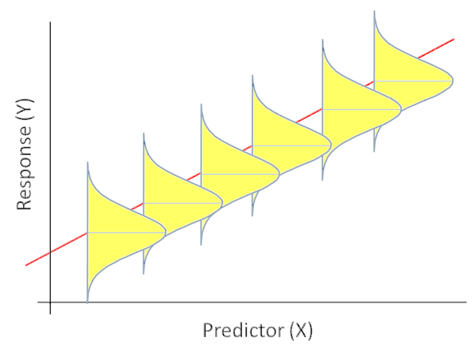

```{r setup, include = FALSE, cache = FALSE}
knitr::opts_chunk$set(error = TRUE)
knitr::opts_chunk$set(warning=FALSE)
knitr::opts_chunk$set(message=FALSE)
knitr::opts_chunk$set(results="hold")
knitr::opts_chunk$set(cache=TRUE)
```

# Linear Regression 


## Outline


1. One Categorical Covariate
2. One Continuous Covariate
3. Multiple Covariates


## The Data for Class

- We will consider the data behind the story: ["Comic Books are Still Made By Men, For Men and About Men"](http://fivethirtyeight.com/features/women-in-comic-books/).
- This data is part of the `fivethirtyeight` package:
- To explore the variable names run the following code:

```{r, eval=F}
library(fivethirtyeight)
?comic_characters
```


## Appearances

- We will consider appearances on the comic books. 
- We will see what predicts the number of appearances. 


# One Categorical Covariate - Binary


## Binary Covariate

- With this type of covariate, we are comparing some outcome against 2 different groups. 
- In order to make these comparisons it depends on the outcome we are working with. 
- We will perform these tests based on the outcome and then use confidence intervals to assess. 


## Differences in appearances by publisher

- Let's consider the difference in appearances by publisher

```{r, eval=FALSE}
library(fivethirtyeight)
library(tidyverse)

cnt <-  comic_characters%>% 
  group_by(publisher) %>%
  tally()
mn<- comic_characters%>% 
  group_by(publisher) %>%
  summarise(mean_app=mean(appearances, na.rm=T))
full_join(cnt,mn)

```


## Differences in appearances by publisher

- Let's consider the difference in appearances by publisher

```{r, echo=FALSE}
library(fivethirtyeight)
library(tidyverse)

cnt <-  comic_characters%>% 
  group_by(publisher) %>%
  tally()
mn<- comic_characters%>% 
  group_by(publisher) %>%
  summarise(mean_app=mean(appearances, na.rm=T))
full_join(cnt,mn)

```


## Differences in Appearances by Publisher

- We have learned how to do this previously. 
- We first did this comparison with a t-test
- Then we did this with an F-test in ANOVA


## Appearance by Publisher: t-test

- Consider this with a t-test

```{r}
t.test(appearances~publisher, comic_characters)
```


## Appearances by publisher: ANOVA

- Consider with ANOVA

```{r}
library(broom)
tidy(aov(appearances~publisher, comic_characters))
```


## ANOVA vs t-test

- t-test and ANOVA should give us the same results.
- We can see that in our output this is not true. 
- What were the assumptions of ANOVA?


 

## Appearances by publisher: t-test

- Consider this with a t-test

```{r}
t.test(appearances~publisher, comic_characters, var.equal=TRUE)
```


## Linear Regression

```{r, eval=F}
model <- lm(appearances~publisher, comic_characters)
tidy(model)
glance(model)
```


## Linear Regression

```{r, echo=F}
model <- lm(appearances~publisher, comic_characters)
tidy(model)
glance(model)
```


## Interpreting the Coefficients: Categorical

- Intercept is the average for the reference group. 
- Each coefficient is the average change between the reference group and the one of interest. 

## Interpreting the Coefficients: Categorical

- Intercept interpretation: Every DC character has on average 23.6 appearances. 
- Marvel Coefficient: Every marvel character has on average 6.59 less appearances than DC. 


## One Binary Categorical Variable - Continuous Outcome

- We can perform
    - t-test with equal variances
    - ANOVA
    - Linear Regression
- All yield the same exact results


## Assumptions of Linear Regression

- ***Linearity:*** Function $f$ is linear. 
- Mean of error term is 0. 
    \[E(\varepsilon)=0\]
- ***Independence:*** Error term is independent of covariate. 
    \[Corr(X,\varepsilon)=0\]
- ***Homoscedacity:*** Variance of error term is same regardless of value of $X$. 
    \[Var(\varepsilon)=\sigma^2\]
- ***Normality:*** Errors are normally Distributed


## What about more categories?

- We can also use linear regression with multiple categories. 

```{r, eval=F}
mod <- lm(appearances~sex, comic_characters)
tidy(mod)
```


## What about more categories?

- We can also use linear regression with multiple categories. 

```{r, echo=F}
mod <- lm(appearances~sex, comic_characters)
tidy(mod)
```


## How do we interpret? 

- We need to know the baseline. 


```{r, echo=FALSE}
library(fivethirtyeight)
library(tidyverse)

cnt <-  comic_characters%>% 
  group_by(sex) %>%
  tally()
mn<- comic_characters%>% 
  group_by(sex) %>%
  summarise(mean_sex=mean(appearances, na.rm=T))
full_join(cnt,mn)

```

## Working with Factors

- Since we are interested in knowing whether or not male characters appear more often, we need to change how we view the factor.
- We will work on the following:
      - Renaming factors
      - Reordering factor levels. 


## Working with Factors: Renaming

```{r}
comic_characters <- comic_characters %>%
      mutate(sex = fct_recode(sex, 
      "Agender" = "Agender Characters",
      "Female" = "Female Characters", 
      "Genderfluid" = "Genderfluid Characters",
      "Genderless" = "Genderless Characters",
      "Male" = "Male Characters",
      "Transgender" = "Transgender Characters"
      ))
```


## Working with Factors: Relevel

```{r}
comic_characters <- comic_characters %>%
      mutate(sex = fct_relevel(sex, 
                 "Male", 
                 "Agender",
                 "Female" , 
                  "Genderfluid" ,
                  "Genderless" ,
                  "Transgender"
      ))
```


## Regression again

```{r, eval=F}
mod <- lm(appearances~sex, comic_characters)
tidy(mod)
```

## Regression again

```{r, echo=F}
mod <- lm(appearances~sex, comic_characters)
tidy(mod)
```


## Interpreting the Coefficients: Categorical

- Intercept interpretation: Every Male Character has on average 19 appearances. 
- Agender coefficient: Every Agender character has on average 0.64 more appearances than male characters
- ...


## Whats happening?

```{r, eval=F}
ggplot(comic_characters, aes(x = sex, y = appearances)) +
  geom_point()  + 
  geom_point(stat = "summary", fun.y = "mean", color = "red", size = 3) + 
  theme(axis.text.x = element_text(angle = 90, hjust = 1))
```


## Whats happening?

```{r, echo=F}
ggplot(comic_characters, aes(x = sex, y = appearances)) +
  geom_point()  + 
  geom_point(stat = "summary", fun.y = "mean", color = "red", size = 3) + 
  theme(axis.text.x = element_text(angle = 90, hjust = 1))
```


# One Continuous 


## One Continuous Covariate

- We will consider one continuous covariate. 
- We will consider year. 


## Example: Year and Appearances

- Consider the effect of year on appearances. 
- With categorical data we plotted this with box-whisker plots. 
- We can now use a scatter plot


## Scatter Plot: Year and Appearances


```{r, eval=F}
ggplot(comic_characters, aes(year, appearances)) + 
  geom_point() + 
  geom_smooth(method="lm") + 
  xlab("Year") + 
  ylab("Appearances")
```


## Scatter Plot: Year and Appearances


```{r, echo=F}
ggplot(comic_characters, aes(year, appearances)) + 
  geom_point() + 
  geom_smooth(method="loess") + 
  xlab("Year") + 
  ylab("Appearances")
```


## Modeling What We See

- There might not be a connection or there might be a very small one, let's explore further.
- How can we do this? 
- How does linear regression work?


## How do we Quantify this?

- One way we could quantify this is
\[\mu_{y|x} = \beta_0 + \beta_1X\]
- where
    - $\mu_{y|x}$ is the mean time for those whose year is $x$. 
    - $\beta_0$ is the $y$-intercept (mean value of $y$ when $x=0$, $\mu_y|0$)
    - $\beta_1$ is the slope (change in mean value of $Y$ corresponding to 1 unit increase in $x$).


## Population Regression Line

- With the population regression line we have that the distribution of appearances for those at a particular year, $x$, is approximately normal with mean, $\mu_{y|x}$, and standard deviation, $\sigma_{y|x}$. 


## Population Regression Line




## Population Regression Line

- This shows the scatter about the mean due to natural variation. To accommodate this scatter we fit a regression model with 2 parts:
    - Systematic Part
    - Random Part


## The Model

- This leads to the model
\[Y = \beta_0 + \beta_1X + \varepsilon\]
- Where $\beta_0+\beta_1X$ is the systematic part of the model and implies that \[E(Y|X=x) = \mu_{y|x} = \beta_0 + \beta_1x\]
- the variation part where we have $\varepsilon\sim N(0,\sigma^2)$ which is independent of $X$. 


## What do We Have?

- Consider the scenario where we have $n$ subjects and for each subject we have the data points $(x,y)$. 
- This leads to us having data in the form $(X_i,Y_i)$ for $i=1,\ldots,n$.
- Then we have the model:
  $$Y_i = \beta_0 + \beta_1X_i + \varepsilon_i$$
- $Y_i|X_i \sim N\left(\beta_0 + \beta_1X_i , \sigma^2\right)$
- $E(Y_i|X_i) = \mu_{y|x} = \beta_0 + \beta_1X_i$
- $Var(Y|X_i ) = \sigma^2$


## Picture of this


```{r, echo=FALSE}
n <- 10000
x <- seq(1,10, by =0.00090009)
y <- rnorm(n, 3 + 5*x, 1)
Data <- data.frame(x, y)

plot(x,y, type='n')
lines(lowess(y~x), )
segments(3,0,3,40)
points(3,40, pch=16)
points(3, 18, pch=16)
segments(-2,40, 3,40, lty=2)
segments(-2,18, 3,18, lty=2)
text(1.7 , 30, label= "Error E")
arrows(1.7, 30.7, 1.7, 40)
arrows(1.7, 29.3, 1.7, 18)
text(4,50, label= "Observed")
text(4,48, label = "value Y at X")
arrows(4,47, 3,40)
text(4, 15, label=expression(mu["Y|X"]))
arrows(3.7,15, 3.1, 18)
text(8, 30, label="Population Regression Line")
text(8,27, label= expression( mu["Y|X"] ~ "=" ~beta[0] + ~ beta[1]~X  ))
```


## What Does This Tell Us?

- We can refer back to our scatter plot now and discuss what is the "best" line. 
- Given the previous image we can see that a good estimator would somehow have smaller residual errors. 
- So the "best" line would minimize the errors. 


## Residual Errors


```{r, echo=FALSE}
plot(x,y, type='n')
lines(lowess(y~x))
segments(2, 20, 2, 13, lty=2)
points(2,20, pch=16)
segments(4, 10, 4, 23, lty=2)
points(4,10, pch=16)
segments(7, 45, 7, 38, lty=2)
points(7,45, pch=16)
segments(9, 32, 9, 48, lty=2)
points(9,32, pch=16)
text(1.6, 16, label = expression(hat(epsilon)[1]))
text(4.4, 16, label = expression(hat(epsilon)[2]))
text(6.6, 41, label = expression(hat(epsilon)[3]))
text(9.4, 41, label = expression(hat(epsilon)[4]))
```


## In Comes Least Squares

- The least squares estimator of regression coefficients in the estimator that minimizes the sum of squared errors.
- We denote these estimators as $\hat{\beta}_0$ and $\hat{\beta}_1$. 
- In other words we attempt to minimize 
$$\sum_{i=1}^n \left(\varepsilon_i\right)^2 = \sum_{i=1}^n \left(Y_i - \hat{\beta}_0 - \hat{\beta}_1X_i\right)^2$$


## Inferences on OLS

- Once we have our intercept and slope estimators the next step is to determine if they are significant or not. 
- Typically with hypothesis testing we have needed the following:
    - Population/Assumed Value of interest
    - Estimated value
    - Standard error of Estimate


## Confidence Interval Creation

- with 95% confidence intervals of
\[\hat{\beta}_1 \pm t_{n-2, 0.975} \cdot se\left(\hat{\beta}_1\right)\]
\[\hat{\beta}_0 \pm t_{n-2, 0.975} \cdot se\left(\hat{\beta}_0\right)\]
- In general we can find a  $100(1-\alpha)\%$ confidence interval as
\[\hat{\beta}_1 \pm t_{n-2, 1-\dfrac{\alpha}{2}} \cdot se\left(\hat{\beta}_1\right)\]
\[\hat{\beta}_0 \pm t_{n-2, 1-\dfrac{\alpha}{2}} \cdot se\left(\hat{\beta}_0\right)\]


## Example: Year and Appearances

```{r, eval=FALSE}

model <- lm(appearances~year, data=comic_characters)
tidy(model, conf.int=TRUE)[,-c(3:4)]
glance(model)
```


## Example: Year and Appearances

```{r, echo=FALSE}

model <- lm(appearances~year, data=comic_characters)

glance(model)
```


## Example: Year and Appearances

```{r, echo=FALSE}

model <- lm(appearances~year, data=comic_characters)

glance(model)
```

## Interpreting the Coefficients: Continuous

- Before we can discuss the regression coefficients we need to understand how to interpret what these coefficients mean. 
-  $\beta_0$ is mean value for $Y$ when $X=0$.
- What about $\beta_1$?


## Interpreting the Coefficients: Continuous

- Then we consider $\beta_1$ to see the meaning of this we do the following
$$
\begin{aligned}
    E(Y|X=x+1) - E(Y|X=x) &= \beta_0 + \beta_1(x+1) - \beta_0 - \beta_1x\\
    &= \beta_1
\end{aligned}
$$


## Interpreting the Coefficients: Continuous

- We consider $\beta_0$ first. 
- Does this value have meaning with our current data? 
    - The estimated value of time level is only applicable to year within the range of our data. 
    - Many times the intercept is scientifically meaningless. 
    - Even if meaningless on its own, $\beta_0$ is necessary to specify the equation of our regression line. 
    - **Note:** People do sometimes use mean centered data and the intercept is then interpretable.


## Interpreting the Coefficients: Continuous

- This gives us the interpretation that $\beta_1$ represents the mean change in outcome $Y$ given a one unit increase in predictor $X$. 
- This is not an actual prescription though, this is considering different subjects or groups of subjects who differ by one unit. 
- Below are correct interpretations of $\beta_1$ in our example. 
    - *These results display that the mean difference in appearances for a 1 year difference is -0.596*
    - *These results display that the mean difference in time for a 10 year difference is -5.96*


## Multiple Regression

- We have been discussing simple models so far. 
- This works well when you have:
    - Randomized Data to test between specific groups (Treatment vs Control)
- In most situations we need look at more than just one relationship. 
- Think of this as needing more information to tell the entire story. 


## Multiple Linear Regression with appearances


- First start with univariate models
- Then perform the multiple model


## Multivariate Models


```{r}
mod3 <- lm(appearances~publisher + year, data=comic_characters)
tidy3 <- tidy(mod3, conf.int=T)[,-c(3:4)]
tidy3
```


## Interpreting Multiple Coefficients

- The intercept is when all coefficients are zero. 
- Each other coefficient is interpreted in context to another. 


## Interpreting Multiple Coefficients: Our Example

- Intercept: DC average appearances at year 0. ***Not Meaningful***
- Publisher Coefficient: If we consider 2 characters in the same year, the character from Marvel will have on average 9.54 less appearances than the character from DC. 
- Year Coefficient: If we consider 2 characters from the same publisher, an increase in 1 year will lead to on average 0.62 less appearances. 