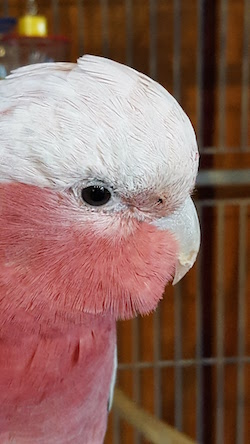

---
title: "Transformations"
author: "Merlise Clyde"
date: "Readings: Gelman & Hill Ch 2-4"
output: 
   beamer_presentation:
         includes:
            in_header: macros.tex
---

```{r setup, include=FALSE}
knitr::opts_chunk$set(echo = FALSE)
library(dplyr)
```

## Assumptions of Linear Regression

$$ Y_i = \beta_0 + \beta_1 X_{i1} + \beta_2 X_{i2} + \ldots \beta_{p} X_{ip} + \epsilon_i$$

-  Model Linear in $X_j$  but $X_j$ could be a transformation of the original variables
-  $\epsilon_i \sim N(0, \sigma^2)$
-  $Y_i \ind \N(\beta_0 + \beta_1 X_{i1} + \beta_2 X_{i2} + \ldots \beta_{p} X_{ip}, \sigma^2)$
- correct mean function
- constant variance
- independent errors
- Normal errors

## Animals

Read in Animal data from MASS.  The data set contains measurements on body weight and brain weight.

Let's try to predict brain weight (size) from body weight.

```{r data, echo=T, warnings=FALSE, message=FALSE}
library(MASS)
data(Animals)
brain.lm = lm(brain ~ body, data=Animals)
```

## Diagnostic Plots

```{r resid-plots}
par(mfrow=c(2,2))
plot(brain.lm)
```


##  Leverage plot

```{r, fig.width=6}
plot(hatvalues(brain.lm), type="h")
```

_Energetic students: how I should plot with ggplot?_

##  Outliers and Influential Points

Flag outliers after Bonferroni Correction

```{r, echo=T}
pval = 2*(1 - pt(abs(rstudent(brain.lm)), brain.lm$df -1)) 
rownames(Animals)[pval <  .05/nrow(Animals)]
```

Cook's Distance > 1
```{r, echo=T}
rownames(Animals)[cooks.distance(brain.lm) > 1]
```

## Remove Influential Point & Refit

```{r, echo=T, fig.height=6}
brain2.lm = lm(brain ~ body, data=Animals, 
               subset = !cooks.distance(brain.lm)>1)
par(mfrow=c(2,2)); plot(brain2.lm)
```

## Keep removing points? 

```{r}
infl = rownames(Animals) %in% c("Brachiosaurus", "Dipliodocus")
brain3.lm = lm(brain ~ body, data=Animals, 
               subset = !infl)
par(mfrow=c(2,2)); plot(brain3.lm)
```

## And another one bites the dust

```{r}
infl = rownames(Animals) %in% c("Brachiosaurus", "Dipliodocus", "Triceratops")
brain4.lm = lm(brain ~ body, data=Animals, 
               subset = !infl)
par(mfrow=c(2,2)); plot(brain4.lm)
```

## and another one


```{r}
infl = rownames(Animals) %in% c("Brachiosaurus", "Dipliodocus", "Triceratops", "African elephant")
brain5.lm = lm(brain ~ body, data=Animals, 
               subset = !infl)
par(mfrow=c(2,2)); plot(brain5.lm)
```


## And they just keep coming! 


##  Plot of Original Data (what you should always do first!)

```{r, echo=T, fig.height=5}
library(ggplot2)
ggplot(Animals, aes(x=body, y=brain)) +
  geom_point() +
  xlab("Body Weight") + ylab("Brain Weight") 
```


## Log Transform

```{r, warnings=FALSE, message=FALSE, fig.height=5}
par(mfrow=c(1,2))
hist(Animals$body, xlab="Body Weight", main="")
hist(log(Animals$body), xlab="log(Body Weight)", main="")
```

_Who can reproduce this slide using ggplot?  Tell me how on Piazza! Even better make a pull request!_

## Plot of Transformed Data

```{r trans, echo=T, fig.height=5}
Animals= mutate(Animals, log.body = log(body))
ggplot(Animals, aes(log.body, brain)) + geom_point()
#plot(brain ~ body, Animals, log="x")
```

##  Diagnostics with log(body)

```{r lm.tran, fig.height=6}
braintransX.lm = lm(brain ~ log(body), data=Animals)
par(mfrow=c(2,2))
plot(braintransX.lm)
```

Variance increasing with mean 

## Try Log-Log

```{r trans-both, echo=T, fig.height=5}
Animals= mutate(Animals, log.brain= log(brain))
ggplot(Animals, aes(log.body, log.brain)) + geom_point()
#plot(brain ~ body, Animals, log="xy")
```


##  Diagnostics with log(body) & log(brain)

```{r lm.tran.both, fig.height=6}
braintransXY.lm = lm(log(brain) ~ log(body), data=Animals)
par(mfrow=c(2,2))
plot(braintransXY.lm)
```

## Optimal Transformation for Normality

The BoxCox procedure can be used to find ``best'' power transformation $\lambda$ of
$Y$ (for positive Y) for a given set of transformed predictors.

$$\Psi(\Y, \lambda) = \left\{
  \begin{array}{ll}
    \frac{\Y^{\lambda} -1}{\lambda} & \text{ if } \lambda \neq 0\\
    \log(\Y) & \text{ if } \lambda = 0
  \end{array}
\right .
$$ 
Find value of $\lambda$ that maximizes the likelihood derived from $\Psi(\Y, \lambda) \sim \N(\X \b_{\lambda}, \sigma^2_\lambda)$   (need to obtain distribution of $\Y$ first)


Find $\lambda$ to minimize
$$\textsf{RSS}(\lambda) = \|\Psi_M(\Y, \lambda) - \X\hat{\b}_\lambda \|^2$$

$$\Psi_M(\Y, \lambda) = \left\{
  \begin{array}{ll}
    (\textsf{GM}(\Y)^{1-\lambda}(\Y^{\lambda} -1)/{\lambda} & \text{ if } \lambda \neq 0\\
    \textsf{GM}(\Y) \log(\Y) & \text{ if } \lambda = 0 \\
  \end{array}
\right .
$$ 
where $\textsf{GM}(\Y) = \exp(\sum \log(Y_i)/n)$  (Geometric mean)

 
## boxcox in R: Profile likelihood
 
```{r, echo=T, fig.height=6}
library(MASS)
boxcox(braintransX.lm)
```


## Caveats

- Boxcox transformation depends on choice of transformations of $X$'s
- For choice of X transformation use `boxTidwell` in `library(car)`
- transformations of $X$'s can reduce leverage values (potential influence)
- if the dynamic range of $Y$ or $X$ is less than 1 or 10
(ie max/min) then transformation may have little effect
- transformations such as logs may still be useful for interpretability
- outliers that are not influential may still 

## Review of Last Class

- In the model with both response and predictor log transformed, are dinosaurs outliers?
- should you test each one individually or as a group; if as a group how do you think you would you do this using lm?
- do you think your final model is adequate?  What else might you change?

## Check Your Prediction Skills

After you determine whether dinos can stay or go and refine your model, what about prediction?  

- I would like to predict Aria's brain size given her current weight of 259 grams.  Give me a prediction and interval estimate.
- Is her body weight within the range of the data in Animals or will you be extrapolating?   What are the dangers here?

-  Can you find any data on Rose-Breasted Cockatoo brain sizes?  Are the values in the prediction interval?
