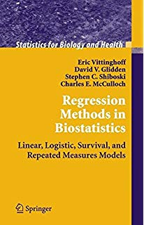

[PDF of Syllabus](../syllabus/syllabus.pdf)

## Course goals & objectives:

This course provides a survey of regression techniques for outcomes common in public health data including continuous, binary, count and survival data.  Emphasis is on developing a conceptual understanding of the application of these techniques to solving problems, rather than to the numerical details. Extensive use of the computer will be made for analysis of datasets.

This course is designed for graduate and advanced undergraduate students who will be analyzing data with scientific colleagues and who want to develop a practical hands-on toolkit and gain experience in distilling complex statistical information into formats understandable to colleagues. This course will feature R programming elements. To make the most of R students will be expected to use \href{https://www.rstudio.com/}{RStudio}. There are videos on the course's R page to explain how to get set up and started in RStudio. 

After successful completion of this course you will understand and be able to develop and interpret regression models to describe how an outcome is related to one or more predictor variables. In particular these include the following capabilities:

1. Recognize when data should be analyzed by regression
2. Plan an appropriate analysis
3. Bring in, Clean and Analyze data with R. 
4. Coherently summarize results. 

### Overall Course Expectations

Students in this course will be expected to do the following:

1. Attend all lectures and actively participate in discussion. 

2. Read all assigned material *prior* to coming to class and actively participate in class discussions. 

3. Complete and turn in all assignments on time. Solutions to homework must be clearly written with appropriate tables and figures included. 

4. Demonstrate an understanding on material on examinations. 

5. Respect each other, each others questions and each others discussion. 

### Topics

Course topics will be drawn (but subject to change) from

* Linear Regression
* Linear Regression Diagnostics
* Generalized Linear Models
* Nonlinear Regression
* Robust Regression
* Mixed Effects Models

## Books and Resources

### Required

{:.right}

 **Applied Regression Analysis and Generalized Linear Models** by
  John Fox Jr.
  [Amazon](https://www.amazon.com/Applied-Regression-Analysis-Generalized-Linear-ebook/dp/B00YFSZPTE).
  We follow this book for content and pacing. 

* * *

{:.right}

 **Regression Methods in Biostatistics** by
   Eric Vittinghoff, David V. Glidden, Stephen C. Shiboski, Charles E. McCulloch 
  [Amazon](https://www.amazon.com/Regression-Methods-Biostatistics-Logistic-Statistics/dp/1461413524).
  We follow this book for content and pacing. 

* * *

### Suggested

{:.right}

 **An Introduction to Statistical Learning: with Applications in R** by 
  Gareth James, Daniela Witten, Trevor Hastie, Robert Tibshirani.

We will use this as a reference to some methods as well as a resource for data and R code. 

This is  available freely available as an eBook  [Get it
  ](http://www-bcf.usc.edu/~gareth/ISL/)
  .  If you prefer a paperback version you may buy it at cost from
  Springer (see links from library site) or purchase a hardback version at the through Amazon.

For additional information check out [Videos for
  the ISL book](https://www.r-bloggers.com/in-depth-introduction-to-machine-learning-in-15-hours-of-expert-videos/)  

Other resources for reference books, statistical computing using R,
  etc are provided on the
  [Resource]({{site.baseurl}}/resources) tab
  

* * *

## Grading:

Students will be evaluated based on:

| Grade  | Category | Percentage |
| --------------- | ----------------- | ------------- |
| Participation       |                    10%   |
| Homework             |                   20%  | 
| Exam 1 (03/13/2019)   |                  20% | 
| Exam 2 (05/8/2019)  |                 20%  |
| Reproducible Research Project  |           30% |

* * * 

## Course Hours

| Task | Hours Spent on Task | 
| :--------- | :-----------------: | 
Class Time       |      40|
| Homework/Class Preparation   |             90 |
| Exams/Prep  | 25 |
| Reproducible Research Project |  45 | 

* * * 

## Evaluation Category Details

### Participation

This course will move very fast and it is crucial to success in the course that students attend and participate. Many classes will have polls or quizzes that will not be graded for having the most correct or best answer but for participating. Unexcused absences will result in a loss of percentage points. 

### Homework

Weekly assignments will be given out to students. Assignments will require data handling, data cleaning and interpretation of the results.  It is expected that all assignments are completed on time. No late assignments will be accepted. 

Students will also be graded on the conciseness and quality of work. Turning in many pages of just computer code and output will affect the grade in a negative fashion.

### Exam 1 (March 13, 2019 in Class)

An in class exam will be given. Students will be expected to interpret and analyze regression models. Students will also be expected to understand conceptual ideas. 

### Exam  2 (May 8, 2019 in Class)

An in class exam will be given. Students will be expected to interpret and analyze regression models. Students will also be expected to understand conceptual ideas. 

### Reproducible Research Project

Students will spend the semester working on a Reproducible Research Project. This project will require:

1. Asking a relevant public Health question for those in 2511 and a relevant scientific question for those in 1511. 
2. Identify available data to answer this question. 
3. Model the question with appropriate statistical models. 
4. Write up a report with appropriate tables, graphs and results. 

The project will consist of individual as well as group content. For the individual content you will complete the 4 requirements. For the group component. You will work in small groups to evaluate each others work. This will require:

1. Constructive Criticism of Group members Projects based on Course Content. 
2. In depth review of group members work. 

You will be graded on both individual and group aspects. It is important to learn not only how to ask a public health question and answer that question with a study or data but equally important to review others work and arguments. 

## Differences between PHP 1511/2511

Given the nature of this course with multiple levels of students from Undergraduate to PhD, it is important to discuss the differences of expectations and how students will be graded. 

### Undergraduates

| Grade Category | Comments | 
| ----------------- | ---------------------------------------------------- |
| Participation  |                 Graded the same as all students, Must be in class and prepared to work in groups.  |
| Homework        |                Students will be expected to complete a portion of the material with the exception of some more difficult problems which may be attempted but do not have to be complete. | 
| Exam 1 & 2              |        Students will be expected to complete a portion of the exam.  |
| Reproducible Research Project |  Students will be expected to complete a reproducible research project. Data as well as questions explored will be at a level appropriate of the background and other statistical courses taken. This will be a semester long project so it will require a great deal of work. |

 

### Graduate Students

| Grade Category | Comments | 
| ----------------- | ---------------------------------------------------- |
| Participation  |                 Graded the same as all students, Must be in class and prepared to work in groups.  |
| Homework        |                 Students will be expected to complete the entire assignment. | 
| Exam 1 & 2              |       Students will be expected to complete the entire exam.  |
| Reproducible Research Project |  Students will be expected to complete a reproducible resaerch project. Data as well as questions explored will be at a level appropriate of the background and other statistical courses taken. This will be a semester long project so it will require a great deal of work.  |

* * *

### Statistical Analysis:

 We will use R as a programming language for data analysis and use
  existing packages written in R to support the course. You should have access to a laptop
  or desktop capable of running [R or
  RStudio]({{site.baseurl}}/resources).  We will also provide access
  to a dedicated server running RStudio Pro for all students that will
  have a unified environment.  See the
  [Resources]({{site.baseurl}}/resources) page for books and other
  resources for learning R.

* * *

### Email and Discussion Forums

* We will be using
[Slack](https://join.slack.com/t/php15112511sp-uym3228/shared_invite/enQtNTI5OTM4MzczMTY5LWRkMzdjODdjODc0MjRhNzVhMWU5OGUyZTE3NTE2YWUyYjk0ZjVmZGJjMDAzODA1MDBmMWZiODM5ZTA5YjcxOWU) for class
discussion. 
* The system is highly catered to getting you help fast and efficiently from classmates, the TAs, and myself. 
* Rather than emailing questions to the teaching staff, I encourage you to post your questions on Slack (peer answers earn participation points!). 

Any non-personal questions related to the material covered in class,
problem sets, labs, projects, etc. should be posted on slack.
Before posting a new question please make sure to check if your question has already been answered. The TAs and myself will be answering questions on the forum daily and all students are expected to answer questions as well. Please use informative titles for your posts.

Note that it is more efficient to answer most statistical questions
``in person" so make use of Office Hours.

## Students with Special Needs

Brown University is committed to full inclusion of all students. Students who, by nature of a documented disability, require academic accommodations should contact the professor during office hours. Students may also speak with Student and Employee Accessibility Services at 401-863-9588 to discuss the process for requesting accommodations.

## Diversity Statement

This course is designed to support an inclusive learning environment where diverse perspectives are recognized, respected and seen as a source of strength. It is our intent to provide materials and activities that are respectful of various levels of diversity: mathematical background, previous computing skills, gender, sexuality, disability, age, socioeconomic status, ethnicity, race, and culture.  

## English Language Learners

Brown University welcomes students from around the world, and the unique perspectives international students bring enrich the campus community.  To empower students whose first language is not English, an array of ELL support is available on campus including language and culture workshops and individual appointments. For more information about English Language Learning at Brown, contact the ELL Specialists at ellwriting@brown.edu.

